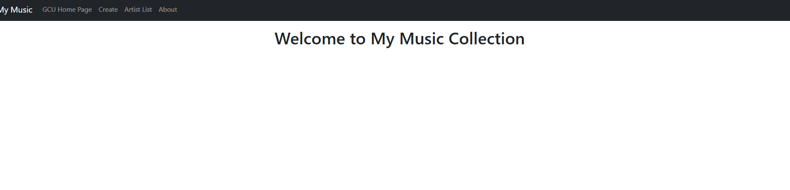
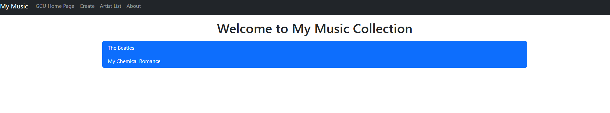
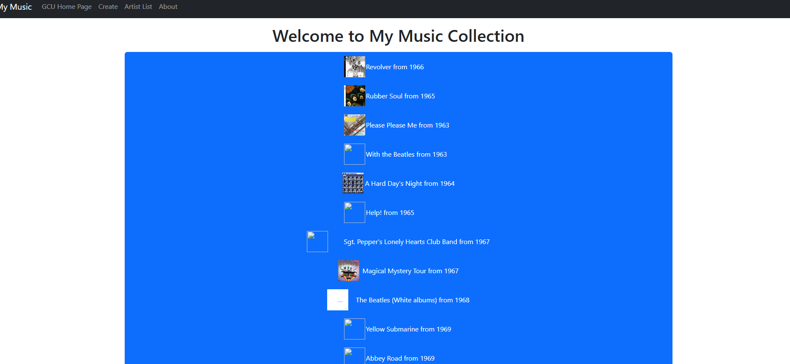
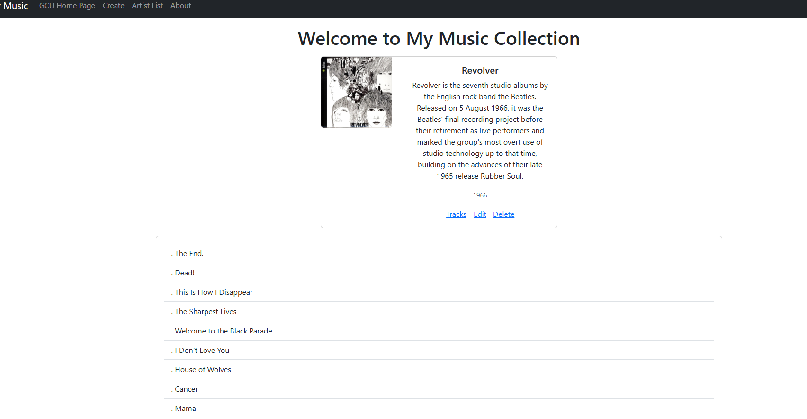
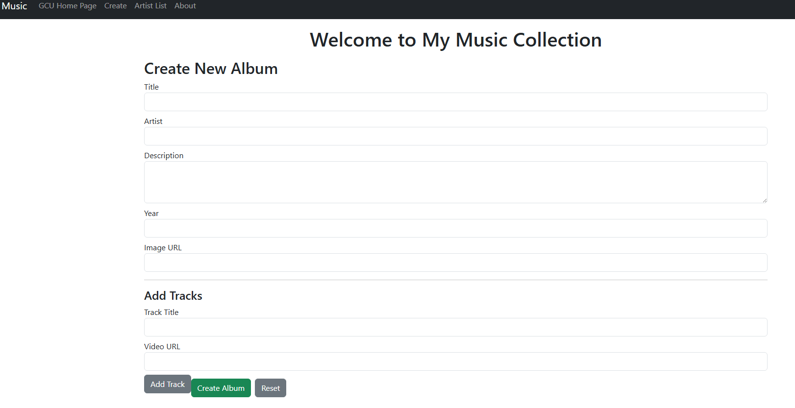
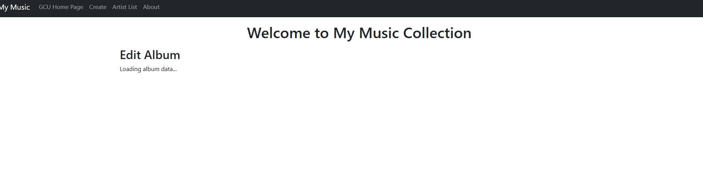
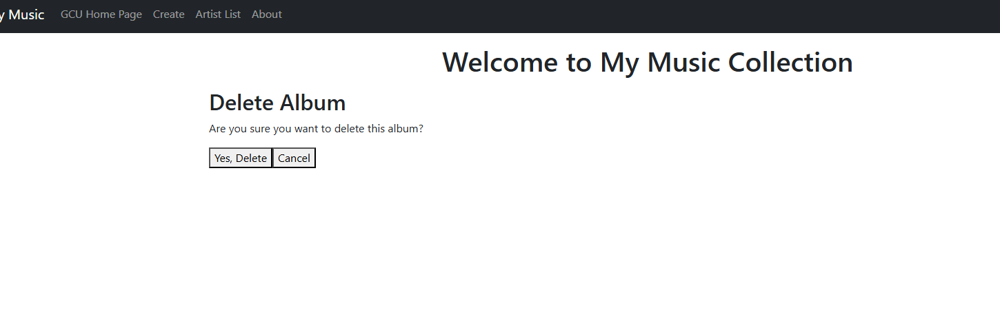

# CST-391: JavaScript Web Application Development

- Activity 4: Music Application – Integration with Back End
- Author: **Victor Manuel Marrujo Verdugo**
- College of Humanities and Social Sciences, Grand Canyon University
- Professor Bobby Estey
- May 3, 2026

---

# Part 1 – Introduction

In this activity, the Music Application front end built in Activity 3 was integrated with the Express MusicAPI back end developed in Activity 1. The Angular application was refactored to replace all mock JSON data with live HTTP calls to the running API server. The `MusicServiceService` was updated to use Angular's `HttpClient`, and every component that previously consumed the service's synchronous return values was updated to use asynchronous callback functions instead.

The activity also completed the edit and delete album features, which were placeholders in Activity 3. The `EditAlbumComponent` now fetches a live album from the API and passes it to the shared `CreateAlbumComponent` for editing, and the `DeleteAlbumComponent` calls the DELETE endpoint and navigates back to the artist list on success.

---

# Part 2 – HttpClient Integration

## 2.1 – Adding HttpClient to the Application

In Angular 19's standalone architecture, `HttpClientModule` is replaced by the `provideHttpClient()` provider function. This was added to `app.config.ts`:

```typescript
import { provideHttpClient } from '@angular/common/http';

export const appConfig: ApplicationConfig = {
  providers: [
    provideRouter(routes),
    provideHttpClient(),
    importProvidersFrom(FormsModule, ReactiveFormsModule)
  ]
};
```

## 2.2 – Refactored Music Service

The `MusicServiceService` was completely rewritten. The hard-coded JSON data and synchronous return values were replaced with `HttpClient` calls that use the Observable `.subscribe()` pattern and deliver results through callback functions.

A private `host` property holds the base API URL:

```typescript
private host = 'http://localhost:5000';
```

Each method now accepts a callback parameter instead of returning a value directly. For example, `getArtists`:

```typescript
public getArtists(callback: (artists: Artist[]) => void): void {
  this.http.get<Artist[]>(this.host + '/artists')
    .subscribe((artists: Artist[]) => {
      callback(artists);
    });
}
```

The full set of methods implemented:

| Method | HTTP Verb | Endpoint |
|--------|-----------|----------|
| getArtists(callback) | GET | /artists |
| getAlbums(callback) | GET | /albums |
| getAlbumsOfArtist(artistName, callback) | GET | /albums/:artist |
| getAlbum(albumId, callback) | GET | /albums?albumId= |
| createAlbum(album, callback) | POST | /albums |
| updateAlbum(album, callback) | PUT | /albums |
| deleteAlbum(id, callback) | DELETE | /albums/:albumId |

## 2.3 – Updated Component Calls

Every component that called the service was updated to pass a callback instead of assigning a return value.

`list-artists.ts` - `ngOnInit`:
```typescript
this.service.getArtists((artists: Artist[]) => {
  this.artists = artists;
  console.log('this.artists', this.artists);
});
```

`list-albums.ts` - `ngOnInit`:
```typescript
this.service.getAlbumsOfArtist(this.artist!.artist,
  (albums: Album[]) => this.albums = albums);
```

`create-album.ts` - `onSubmit`:
```typescript
if (this.isEditMode) {
  this.service.updateAlbum(this.newAlbum, () => {
    this.router.navigate(['list-artists'], { queryParams: { data: new Date() } });
  });
} else {
  this.service.createAlbum(this.newAlbum, () => {
    this.router.navigate(['list-artists'], { queryParams: { data: new Date() } });
  });
}
```

---

# Part 3 – Edit and Delete Album

## 3.1 – Edit Album

The `EditAlbumComponent` was completed. On `ngOnInit` it reads the `id` route parameter and calls the service to fetch the live album, then passes it as an `@Input` to the shared `CreateAlbumComponent`:

```typescript
ngOnInit(): void {
  const id = Number(this.route.snapshot.paramMap.get('id'));
  this.service.getAlbum(id, (album: Album) => {
    this.album = album;
  });
}
```

The `CreateAlbumComponent` detects edit mode via the `@Input() album` property and pre-populates the form. On submit it calls `updateAlbum` instead of `createAlbum`.

## 3.2 – Delete Album

The `DeleteAlbumComponent` reads the `artist` and `id` route parameters and presents a confirmation screen. On confirm it calls the service and navigates back:

```typescript
delete() {
  this.service.deleteAlbum(this.id, () => {
    this.router.navigate(['list-artists'], { queryParams: { data: new Date() } });
  });
}
```

---

# Part 4 – Research: How Angular Maintains Logged-In State

Angular applications maintain logged-in state primarily through **JSON Web Tokens (JWT)**. When a user logs in, the server authenticates their credentials and returns a signed JWT. The Angular application stores this token (typically in `localStorage` or `sessionStorage`) and attaches it to every subsequent HTTP request using an `HttpInterceptor`.

An `HttpInterceptor` is a service that intercepts outgoing HTTP requests before they are sent. It clones the request and adds an `Authorization` header with the token:

```typescript
intercept(req: HttpRequest<any>, next: HttpHandler) {
  const token = localStorage.getItem('token');
  if (token) {
    const cloned = req.clone({
      headers: req.headers.set('Authorization', 'Bearer ' + token)
    });
    return next.handle(cloned);
  }
  return next.handle(req);
}
```

The server validates the JWT signature on every request, so no session state needs to be stored server-side, and the token itself carries the user identity. On the Angular side, an `AuthGuard` can be applied to routes to prevent unauthenticated users from accessing protected pages, redirecting to a login page if no valid token is present in storage.

The Angular `Router` and `ActivatedRoute` services also play a role because after a successful login the guard reads the originally requested URL and redirects the user back to it after authentication completes. This pattern keeps the Angular application stateless between page refreshes as long as the token remains valid in storage.

---

# Part 5 – Screenshots



- **Figure 1** - Main Application screen


- **Figure 2** - Artist List screen


- **Figure 3** - Album List screen


- **Figure 4** - Album Display with tracks expanded

- **Figure 5** - Add Album screen


- **Figure 6** - Edit Album screen *(optional)*


- **Figure 7** - Delete Album confirmation screen *(optional)*