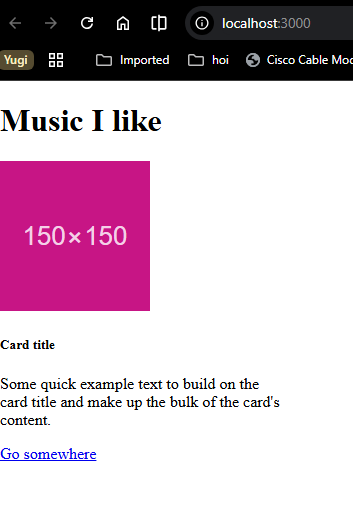
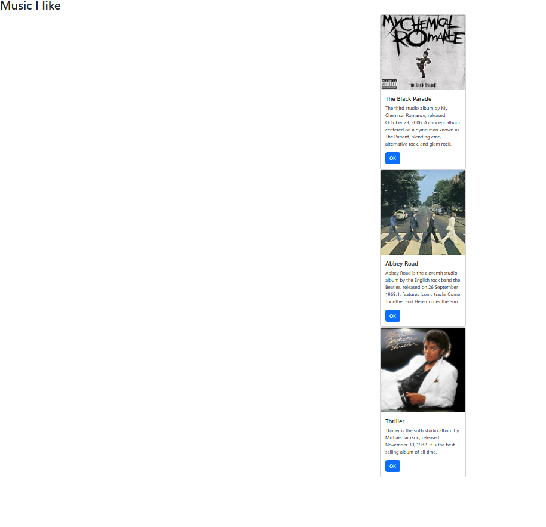
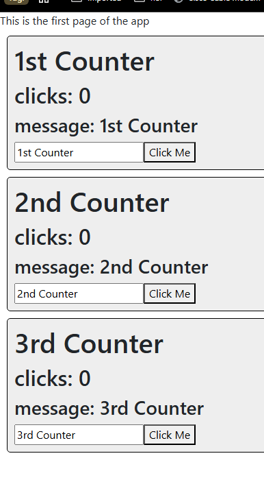
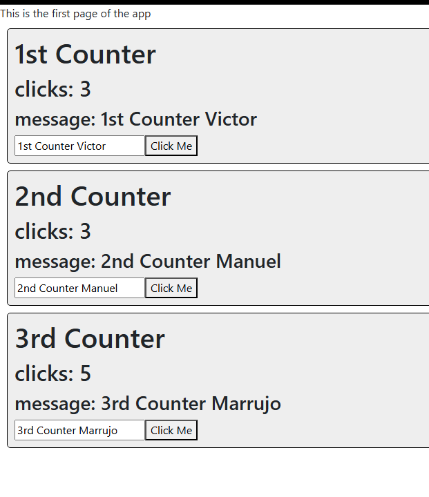
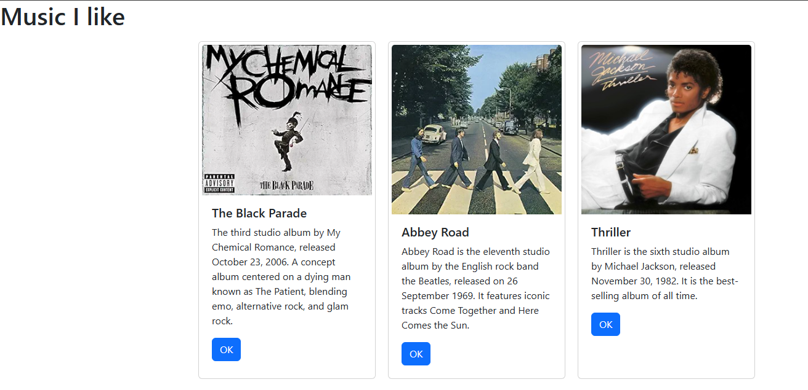
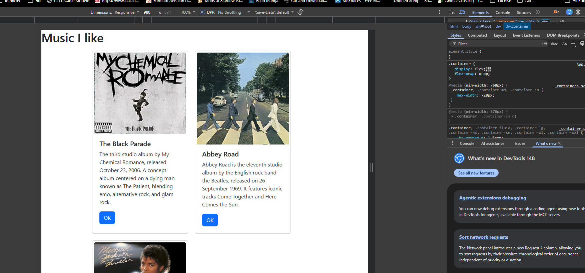

# CST-391: JavaScript Web Application Development

- Activity 5: React Music App Introduction
- Author: **Victor Manuel Marrujo Verdugo**
- College of Humanities and Social Sciences, Grand Canyon University
- Professor Bobby Estey
- May 10th, 2026

---

# Introduction

In this activity, React was introduced as a front-end JavaScript library for building user interfaces using reusable components. The activity is divided into two parts. Part 1 builds the `music` React application from scratch, introducing JSX, custom components, and component properties (props). A separate mini app called `statechanger` is then built to demonstrate the `useState` hook, state management, and event handlers. Part 2 returns to the `music` app and applies state and props to dynamically render album cards using the JavaScript `map` function and CSS FlexBox layout.

---

# Part 1 – React Music App Introduction

## Step 1 — Creating the App

The music app was created using the Create React App toolchain:

```bash
npx create-react-app music
cd music
npm start
```

All default files in `src/` were deleted. A new `index.js` was created as the application entry point. Since this project uses React 19, `createRoot` is used instead of the legacy `ReactDOM.render`:

```javascript
import React from 'react';
import { createRoot } from 'react-dom/client';
import App from './App';

const root = createRoot(document.getElementById('root'));
root.render(<App />);
```

The `index.html` file in `public/` already contains a `<div id="root">` element, so this is where the entire React application is mounted by `createRoot`.

## Step 2 — JSX Basics

**JSX** is the syntax used inside React components. It looks like HTML but is actually JavaScript. Every component must return a **single parent element**. The following is incorrect because it has two distinct root elements:

```javascript
// INCORRECT — two parent elements
const App = () => {
  return <div>This is the app!</div>
         <p>Some more text</p>
}
```

The correct version wraps everything in one parent:

```javascript
// CORRECT
const App = () => {
  return (
    <div>
      <h2>This is the app!</h2>
      <p>Some more text</p>
    </div>
  )
}
```

Two other important JSX differences from HTML:

- `class` is a reserved JavaScript keyword, so `className` is used instead
- Inline styles are JavaScript objects with double curly braces:

```javascript
// HTML
<div class="card" style="width: 18rem;">

// JSX
<div className="card" style={{ width: '18rem' }}>
```

## Step 3 — Adding Bootstrap

Bootstrap 5 was added to `public/index.html` via CDN inside the `<head>` tag so that Bootstrap classes render correctly across all components:

```html
<link rel="stylesheet"
  href="https://cdn.jsdelivr.net/npm/bootstrap@5.3.0/dist/css/bootstrap.min.css" />
```

## Step 4 — Adding a Bootstrap Card

A Bootstrap card was added directly to `App.js` to display a single album. The HTML was converted to JSX by changing `class` to `className`, self-closing the `` tag, and converting the style string to a JavaScript object:

```javascript
import React from 'react';

const App = () => {
  return (
    <div>
      <h1>Music I like</h1>

      <div className="card" style={{ width: '18rem' }}>
        
        <div className="card-body">
          <h5 className="card-title">Card title</h5>
          <p className="card-text">Some quick example text.</p>
          <button className="btn btn-primary">Go somewhere</button>
        </div>
      </div>

    </div>
  );
};

export default App;
```

## Step 5 — Custom Card Component

Rather than copy-pasting the same card HTML three times, a reusable `Card` component was created in `Card.js`. This keeps `App.js` clean and makes each card independently configurable via props:

```javascript
import React from 'react';

const Card = (props) => {
  return (
    <div className='card' style={{ width: '18rem' }}>
      
      <div className='card-body'>
        <h5 className='card-title'>{props.albumTitle}</h5>
        <p className='card-text'>{props.albumDescription}</p>
        <button className='btn btn-primary'>
          {props.buttonText}
        </button>
      </div>
    </div>
  );
};

export default Card;
```

The `export default Card` at the bottom makes this component importable in other files. The `props` parameter contains all the attributes passed in from the parent.

## Step 6 — Component Properties (Props)

Back in `App.js`, the Card component is imported and used three times with real album data passed as props. Each `<Card />` tag receives `albumTitle`, `albumDescription`, `imgURL`, and `buttonText`:

```javascript
import React from 'react';
import Card from './Card';

const App = () => {
  return (
    <div>
      <h1>Music I like</h1>

      <Card
        albumTitle="The Black Parade"
        albumDescription="The third studio album by My Chemical Romance, released October 23, 2006."
        imgURL="https://upload.wikimedia.org/wikipedia/en/6/67/The_Black_Parade_Album_Cover.png"
        buttonText="OK"
      />
      <Card
        albumTitle="Abbey Road"
        albumDescription="Abbey Road is the eleventh studio album by the English rock band the Beatles, released on 26 September 1969."
        imgURL="https://upload.wikimedia.org/wikipedia/en/4/42/Beatles_-_Abbey_Road.jpg"
        buttonText="OK"
      />
      <Card
        albumTitle="Thriller"
        albumDescription="Thriller is the sixth studio album by Michael Jackson, released on November 30, 1982."
        imgURL="https://upload.wikimedia.org/wikipedia/en/5/55/Michael_Jackson_-_Thriller.png"
        buttonText="OK"
      />

    </div>
  );
};

export default App;
```

---

## Stopping Point #1 – Custom Components



**Figure 1** — Music app running with a single Bootstrap card after Bootstrap CDN was added.



**Figure 2** — Music app with three reusable Card components, each receiving different album data via props.

React components allow a UI element to be defined once and reused with different data via props. The `Card` component encapsulates the Bootstrap card markup. JSX requires `className` instead of `class`, self-closing image tags, and inline styles as JavaScript objects. The `export default` / `import` pattern is how components share code across files, the same pattern used in the Express API and Angular application.

---

# Mini App #1 — State Changer Demo

A separate mini app called `statechanger` was created to demonstrate state, props, and event handlers before applying these concepts back in the music app.

```bash
npx create-react-app statechanger
cd statechanger
npm start
```

All default files in `src/` were deleted and replaced with the following.

## index.js

```javascript
import React from 'react';
import { createRoot } from 'react-dom/client';
import App from './App';

const root = createRoot(document.getElementById('root'));
root.render(<App />);
```

## App.js

```javascript
import React from 'react';
import Counter from './Counter';

// This is a functional component
const App = () => {
  return (
    <div>
      This is the first page of the app
      <Counter title="1st Counter" />
      <Counter title="2nd Counter" />
      <Counter title="3rd Counter" />
    </div>
  );
};

export default App;
```

## Counter.js

`Counter.js` demonstrates two independent uses of `useState`, one to track button clicks and one to track the text input. Each Counter component is fully independent with its own state:

```javascript
import React, { useState } from 'react';
import './Counter.css';

const Counter = (props) => {
  // useState hook — tracks click count, initialized to 0
  const [clicks, setClicks] = useState(0);

  // useState hook — tracks message input, initialized to the title prop
  const [message, setMessage] = useState(props.title);

  // Increments click count when button is clicked
  const addOneClick = () => {
    setClicks(clicks + 1);
  };

  // Updates message state on every keystroke
  const handleNewMessage = (event) => {
    setMessage(event.target.value);
  };

  return (
    <div className='one-box'>
      <h1>{props.title}</h1>
      <h2>clicks: {clicks}</h2>
      <h3>message: {message}</h3>
      <input
        type='text'
        value={message}
        onChange={handleNewMessage}
      />
      <button onClick={addOneClick}>Click Me</button>
    </div>
  );
};

export default Counter;
```

## Counter.css

```css
.one-box {
  border: 1px solid black;
  border-radius: 5px;
  padding: 10px;
  margin: 10px;
  background-color: #eee;
}
```

## Hooks and useState Explained

The `useState` hook is the primary way to manage state in a functional React component. It accepts an initial value and returns an array of two elements, being the current state and a function to update it. JavaScript array destructuring assigns convenient names to both:

```javascript
const [clicks, setClicks] = useState(0);
//     ^current  ^updater    ^initial value
```

Calling `setClicks(clicks + 1)` triggers a re-render of the component, updating the UI. The same applies to `setMessage`. Each state variable is independent, meaning that there is no limit to how many `useState` hooks a component can use.

## State vs. Props

Props are values passed down from a parent component and cannot be directly modified by the child component. State is created and managed inside the component itself and can change over time because of user actions or API responses.

In this example, the `title` prop is used to initialize the `message` state. After that, the state is managed independently inside each Counter component.

---

## Stopping Point #1 – State Changer Screenshots



**Figure 3** — State Changer app with three Counter components showing initial state.



**Figure 4** — Counters after clicking the buttons and typing in the text inputs, demonstrating independent state per component.

---

# Part 2 – State and Props in the Music Application

Returning to the `music` app, the album data was moved into a `useState` state variable and the `map` function was used to dynamically render a `Card` for each album. This replaces the three hard-coded `<Card />` tags from Part 1.

## Updated App.js

```javascript
import React, { useState } from 'react';
import Card from './Card';
import './App.css';

const App = () => {
  // albumList is the state variable holding all albums.
  // setAlbumList is ready to update this from a live API call in Activity 6.
  const [albumList, setAlbumList] = useState([
    {
      artistId: 0,
      artist: 'My Chemical Romance',
      title: 'The Black Parade',
      description:
        'The third studio album by My Chemical Romance, released October 23, 2006. A concept album centered on a dying man known as The Patient, blending emo, alternative rock, and glam rock.',
      year: 2006,
      image:
        'https://upload.wikimedia.org/wikipedia/en/6/67/The_Black_Parade_Album_Cover.png',
    },
    {
      artistId: 1,
      artist: 'The Beatles',
      title: 'Abbey Road',
      description:
        'Abbey Road is the eleventh studio album by the English rock band the Beatles, released on 26 September 1969.',
      year: 1969,
      image:
        'https://upload.wikimedia.org/wikipedia/en/4/42/Beatles_-_Abbey_Road.jpg',
    },
    {
      artistId: 2,
      artist: 'Michael Jackson',
      title: 'Thriller',
      description:
        'Thriller is the sixth studio album by Michael Jackson, released November 30, 1982. It is the best-selling album of all time.',
      year: 1982,
      image:
        'https://upload.wikimedia.org/wikipedia/en/5/55/Michael_Jackson_-_Thriller.png',
    },
  ]);

  // renderedList uses the map function to transform each album into a Card component
  const renderedList = () => {
    return albumList.map((album) => {
      return (
        <Card
          key={album.artistId}
          albumTitle={album.title}
          albumDescription={album.description}
          buttonText='OK'
          imgURL={album.image}
        />
      );
    });
  };

  return (
    <div>
      <h1>Music I like</h1>
      <div className='container'>{renderedList()}</div>
    </div>
  );
};

export default App;
```

## The Map Function

The `map` function transforms every element of an array into a new value and returns a new array without modifying the original. The browser console exercises from the activity demonstrate the concept:

```javascript
// Define a function
function plus3(x) { return x + 3 }

// Create an array
let numbers = [1, 6, 10, 20]

// Apply map — returns [4, 9, 13, 23]
numbers.map(plus3)

// Map to boolean
function isEven(x) { return x % 2 === 0 }
numbers.map(isEven) // [false, true, true, true]

// Map to HTML elements
function renderParagraphs(x) { return "<li>" + x + "</li>" }
numbers.map(renderParagraphs) // ["<li>1</li>", "<li>6</li>", ...]
```

In `App.js`, `renderedList()` applies the same principle, so each `album` object in `albumList` is transformed into a `<Card />` component with its props set from the album's data.

## App.css — CSS FlexBox

`App.css` uses FlexBox to display cards side by side horizontally instead of stacked:

```css
.container {
  display: flex;
  flex-wrap: wrap;
}

.card {
  margin: 10px;
  padding: 5px;
}
```

The `flex-wrap: wrap` property allows cards to wrap to the next line on narrower screens, making the layout responsive. This file is imported at the top of `App.js` with:

```javascript
import './App.css';
```

---

## Stopping Point #2 – State and Props Screenshots



**Figure 5** — Music app showing three album cards rendered horizontally using `useState`, `map`, and CSS FlexBox.

The `map` function goes through every item inside an array and returns a new array based on whatever function is applied to each item. The original array itself is not modified.




**Figure 6** — Music app on a narrower screen showing the FlexBox `flex-wrap` layout in action. 

The `flex-wrap: wrap` property allows the cards to move onto the next line when the screen becomes smaller, making the layout more responsive and easier to view on narrower screens.

---

# Summary

## Stopping Point #1: Custom Components

React components allow UI elements to be created once and reused with different data through props. The `Card` component keeps all the Bootstrap card code in one reusable place while allowing different album information to be passed in from the parent `App` component.

JSX also introduces several syntax differences compared to normal HTML, including the use of `className`, self closing image tags, and inline styles written as JavaScript objects. The `export default` and `import` pattern is also similar to the module system previously used in Express and Angular.

## Stopping Point #2: State and Props

The `useState` hook allows React functional components to store and update dynamic data. In this activity, the `albumList` state variable stores all album information while `setAlbumList` will later allow the data to be updated from a live REST API in Activity 6.

The `map` function was then used to loop through each album object and dynamically generate a `<Card />` component. This is one of the most common patterns used in React applications.

Finally, CSS FlexBox using `display: flex` and `flex-wrap: wrap` was used to organize the cards into a responsive horizontal layout.