# CST-391: JavaScript Web Application Development

- Activity 6: External Data Sources and Navigation Routing
- Author: **Victor Manuel Marrujo Verdugo**
- College of Humanities and Social Sciences, Grand Canyon University
- Professor Bobby Estey
- May 17th, 2026

---

# Introduction

This activity continued building the React music application by connecting it to external data sources and adding navigation routing. It is divided into four parts. Part 3 moves the album data out of the component state and into an external JSON file, then replaces that file with live data fetched from the Express MusicAPI using the Axios HTTP library and the `useEffect` hook. A `SearchForm` component is added to filter albums by description. Part 4 adds React Router to the music application, refactors the component hierarchy with `AlbumList`, `SearchAlbum`, and `OneAlbum` components, and introduces a NavBar for navigation. A separate mini app called `router` is also built to demonstrate routing, protected routes, login state, and URL parameters.

---

# Part 3 – External Data Source

## Stage 1: Moving Data to a JSON File

The first step was to remove the hard-coded album array from `useState` in `App.js` and replace it with an empty array. The album data was moved to a new file `albums.json` in the `src` folder:

```javascript
// App.js - albumList now starts empty, data loaded via useEffect
const [albumList, setAlbumList] = useState([]);
```

```json
[
  {
    "id": 0,
    "title": "The Black Parade",
    "artist": "My Chemical Romance",
    "description": "The third studio album by My Chemical Romance, released October 23, 2006.",
    "year": 2006,
    "image": "https://upload.wikimedia.org/wikipedia/en/6/67/The_Black_Parade_Album_Cover.png"
  },
  {
    "id": 1,
    "title": "Abbey Road",
    "artist": "The Beatles",
    "description": "Abbey Road is the eleventh studio album by the English rock band the Beatles, released on 26 September 1969.",
    "year": 1969,
    "image": "https://upload.wikimedia.org/wikipedia/en/4/42/Beatles_-_Abbey_Road.jpg"
  },
  {
    "id": 2,
    "title": "Thriller",
    "artist": "Michael Jackson",
    "description": "Thriller is the sixth studio album by Michael Jackson, released November 30, 1982. It is the best-selling album of all time.",
    "year": 1982,
    "image": "https://upload.wikimedia.org/wikipedia/en/5/55/Michael_Jackson_-_Thriller.png"
  }
]
```

The JSON file is imported into `App.js` and loaded using `useEffect`:

```javascript
import albums from './albums.json';

// useEffect fires after render - safe place to trigger state changes
// The [albumList] dependency array prevents endless re-calling
useEffect(() => {
  setAlbumList(albums);
}, [albumList]);
```

## useEffect Explained

`useEffect` is a React hook that runs a callback function after the component renders. It is the correct place to trigger side effects such as data fetching, subscriptions, or state updates that depend on external sources. The second parameter is a dependency array, meaning that the effect only re-runs when one of those values changes. Using `[albumList]` means the effect fires once on mount and again if `albumList` changes, preventing an infinite loop.

```javascript
// General pattern
useEffect(() => {
  // Side effect code here - API calls, subscriptions, etc.
  return () => {
    // Optional cleanup - runs before next effect or component unmount
  };
}, [dependency]);
```

## Key Values in a List

React requires a unique `key` prop on each element rendered in a list. Without it a warning appears in the browser console. The `id` field from the JSON data is used as the key:

```javascript
return (
  <Card
    key={album.id}
    albumId={album.id}
    albumTitle={album.title}
    albumDescription={album.description}
    buttonText='OK'
    imgURL={album.image}
  />
);
```

---

## Searching for Music

A new `SearchForm.js` component was created to allow the user to search albums by description. It uses `useState` to track the input text and calls a parent callback via `props.onSubmit` when the form is submitted:

```javascript
import React, { useState } from 'react';

const SearchForm = (props) => {
  const [inputText, setInputText] = useState('');

  // Updates inputText on every keystroke
  const handleChangeInput = (event) => {
    setInputText(event.target.value);
    console.log(inputText);
  };

  // Prevents page reload and passes inputText up to the parent via callback
  const handleFormSubmit = (event) => {
    event.preventDefault();
    props.onSubmit(inputText);
  };

  return (
    <div>
      <form onSubmit={handleFormSubmit}>
        <div className='form-group'>
          <label htmlFor='search-term'>Search for</label>
          <input
            type='text'
            className='form-control'
            placeholder='Enter search term here'
            onChange={handleChangeInput}
          />
        </div>
      </form>
    </div>
  );
};

export default SearchForm;
```

The `<SearchForm />` tag is added to `App.js` and wired to the `updateSearchResults` callback, which updates the `searchPhrase` state variable. The `renderedList` then filters `albumList` using that phrase:

```javascript
const [searchPhrase, setSearchPhrase] = useState('');

const updateSearchResults = (phrase) => {
  console.log('phrase is ' + phrase);
  setSearchPhrase(phrase);
};

// Filter albumList - shows all albums when searchPhrase is empty
const renderedList = albumList.filter((album) => {
  if (
    album.description.toLowerCase().includes(searchPhrase.toLowerCase()) ||
    searchPhrase === ''
  ) {
    return true;
  }
  return false;
});
```

## Passing Values Upward - Props vs State

This is where the distinction between props and state becomes important. Props flow **down** from parent to child. State changes flow **up** through callback functions passed as props. `SearchForm` does not own the album data,`App` does. So `App` passes `updateSearchResults` down to `SearchForm` as the `onSubmit` prop. When the user submits the form, `SearchForm` calls `props.onSubmit(inputText)`, which executes `updateSearchResults` in `App` and updates `searchPhrase` state there. This triggers a re-render and the filtered list updates.

---

## Stage 2: External REST Service with Axios

The third and final stage replaces the JSON file with live data from the Express MusicAPI. Axios is a promise-based HTTP client that handles JSON fetching in one step.

Install Axios:

```bash
npm install axios
```

A `dataSource.js` file was created to configure an Axios instance with the MusicAPI base URL:

```javascript
import axios from 'axios';

export default axios.create({
  baseURL: 'http://localhost:5000'
});
```

`App.js` was updated to replace the JSON import with an `async` Axios call inside `useEffect`:

```javascript
import dataSource from './dataSource';

const loadAlbums = async () => {
  const response = await dataSource.get('/albums');
  setAlbumList(response.data);
};

useEffect(() => {
  loadAlbums();
}, [refresh]);
```

## About Async and Await

`async/await` is the modern JavaScript ES6 way to write asynchronous code. Marking a function `async` allows the use of `await` inside it. `await` pauses execution of that function until the promise resolves, without blocking the rest of the application. This makes asynchronous code read almost like synchronous code.

Before `async/await`, the same fetch would be written with `.then()` chains:

```javascript
// Old promise syntax
const makeRequest = () =>
  getJSON()
    .then(data => {
      console.log(data)
      return "done"
    })
makeRequest()

// New async/await syntax - much cleaner
const makeRequest = async () => {
  console.log(await getJSON())
  return "done"
}
makeRequest()
```

Callback hell! Deeply nested callbacks before async/await made code nearly unreadable and error-prone. `async/await` solves this by flattening the code structure entirely.

---

## Stopping Point #3 Screenshots

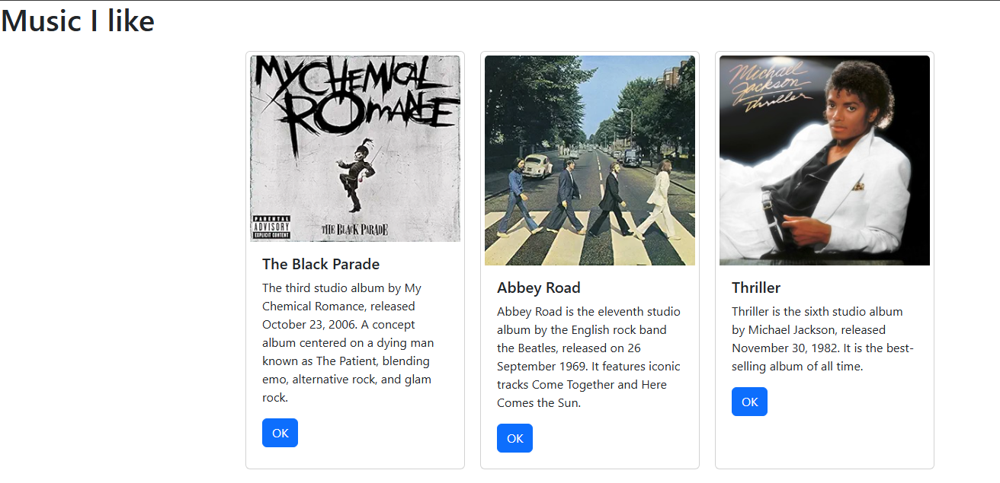
- **Figure 1** - Music app loading albums from the JSON file via `useEffect`

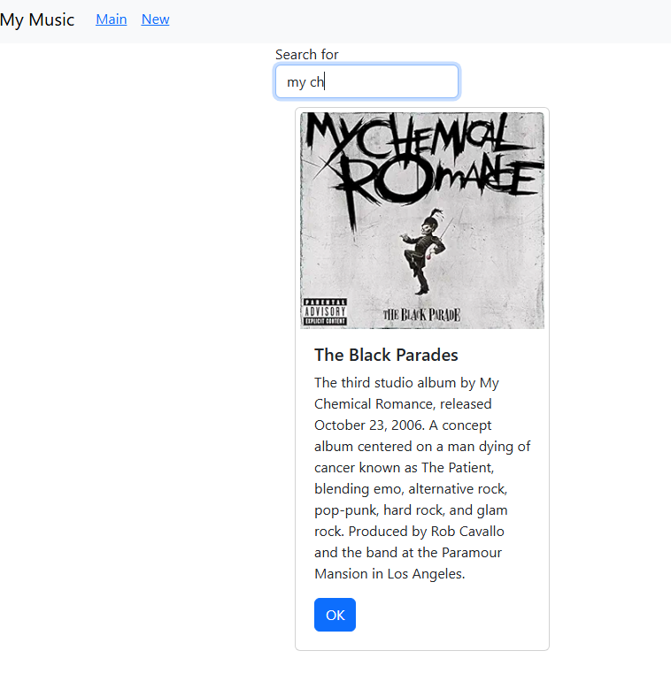
- **Figure 2** - Search form filtering albums by description keyword

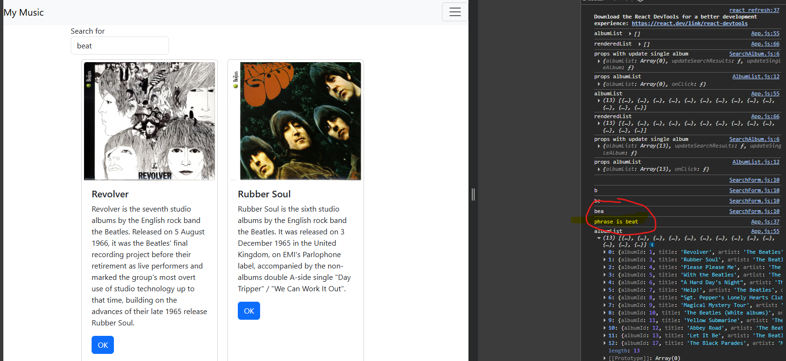
- **Figure 3** - Browser console showing search phrase callback in action

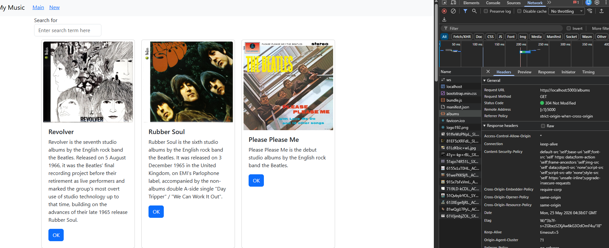
- **Figure 4** - Music app loading live albums from the Express MusicAPI via Axios

**Summary:** The album data was moved through three stages: hard-coded state, external JSON file, and live REST service. `useEffect` is the correct React hook for triggering data fetching after render. `useState` and callbacks allow the `SearchForm` child component to pass user input back up to the `App` parent. Axios simplifies HTTP requests to a single `await` call and correctly handles fetch failures, unlike the native `fetch` API.

---

# Mini App #2 - Routing Application Demo

A new mini app called `router` was created to demonstrate React Router v6 before applying it to the music application.

```bash
npx create-react-app router
cd router
npm install react-router-dom
```

## What is a Route?

A route is a connection between the browser's URL and the content displayed on the page. React Router v6 uses `BrowserRouter`, `Routes`, and `Route` components to define this mapping declaratively in JSX.

## Components Built

### ContactUs.js

```javascript
import React from "react";

const ContactUs = () => {
  return (
    <div>
      <h2>Super Duper Company HQ</h2>
      <p>123 Corporate Circle</p>
      <p>New York, NY</p>
      <p>(123)456-7890</p>
    </div>
  );
};

export default ContactUs;
```

### AboutThisSite.js

```javascript
import React from "react";

const AboutThisSite = () => {
  return (
    <div>
      <h1>About our company</h1>
      <p>We specialize in making great products and services</p>
    </div>
  );
};

export default AboutThisSite;
```

### User.js - URL Parameters with useParams

```javascript
import React from 'react';
import { useParams } from 'react-router-dom';

const User = (props) => {
  let { username } = useParams();
  console.log(props);
  return (
    <div>
      <h2>Hello {username}</h2>
    </div>
  );
};

export default User;
```

`useParams` reads the `:username` segment from the URL (e.g. `/user/Mary`) and makes it available as a variable. This is how React Router passes dynamic route values into components.

### LoginPage.js - useNavigate and useLocation

```javascript
import React from 'react';
import { useLocation, useNavigate } from 'react-router-dom';

const LoginPage = (props) => {
  const handleLogin = () => {
    console.log('handleLogin from ', from);
    console.log('handleLogin navigate ', navigate);
    props.onClick(from, navigate);
  };

  let navigate = useNavigate();
  let location = useLocation();
  let state = location.state;
  let from = state?.from?.pathname ? state.from.pathname : '/';
  let text = '';
  if (from !== '/') text = <h3>You must login to visit "{from}"</h3>;

  return (
    <div>
      {text}
      <button onClick={() => handleLogin()}>Login Here</button>
    </div>
  );
};

export default LoginPage;
```

`useNavigate` returns a function for programmatic navigation. `useLocation` returns the current location object including the `state` passed by a redirect - this is how the app remembers where the user was trying to go before being sent to the login page.

### PrivateRoute.js - Protected Routes

```javascript
import React from 'react';
import { Navigate, useLocation } from 'react-router-dom';

const PrivateRoute = (props) => {
  const authorized = props.authorized;
  const location = useLocation();
  console.log('in PrivateRoute', props);
  console.log('in PrivateRoute', location);
  console.log('in PrivateRoute auth ', authorized);

  return authorized ? (
    props.children
  ) : (
    <Navigate to='/login' state={{ from: location }} />
  );
};

export default PrivateRoute;
```

`PrivateRoute` receives the `authorized` boolean as a prop. If true it renders `props.children` - the protected component. If false it redirects to `/login` and saves the current location in state so the user can be sent back after logging in.

### App.js - BrowserRouter and Routes

```javascript
import React, { useState } from 'react';
import { BrowserRouter, Routes, Route, Link } from 'react-router-dom';
import AboutThisSite from './AboutThisSite';
import ContactUs from './ContactUs';
import LoginPage from './LoginPage';
import User from './User';
import NavBar from './NavBar';
import PrivateRoute from './PrivateRoute';

const App = () => {
  const [isLoggedIn, setIsLoggedIn] = useState(false);

  const handleLogin = (from, navigate) => {
    setIsLoggedIn(true);
    navigate(from, { replace: true });
  };

  return (
    <>
      <BrowserRouter>
        <NavBar />
        <Routes>
          <Route path='/' element={<span></span>} />
          <Route
            path='/about'
            element={
              <PrivateRoute authorized={isLoggedIn}>
                <AboutThisSite />
              </PrivateRoute>
            }
          />
          <Route
            path='/contact'
            element={
              <PrivateRoute authorized={isLoggedIn}>
                <ContactUs />
              </PrivateRoute>
            }
          />
          <Route path='/login' element={<LoginPage onClick={handleLogin} />} />
          <Route path='/user/:username' element={<User />} />
        </Routes>
        <h5>Some friends of mine</h5>
        <ul>
          <li><Link to='user/Mary'>Mary</Link></li>
          <li><Link to='/user/Justine'>Justine</Link></li>
          <li><Link to='/user/Brianna'>Brianna</Link></li>
          <li><Link to='/user/David'>David</Link></li>
        </ul>
      </BrowserRouter>
    </>
  );
};

export default App;
```

`BrowserRouter` is the top-level wrapper that uses the HTML5 history API to keep the URL in sync with the UI. `Routes` is the immediate parent of all `Route` elements. Each `Route` maps a `path` to an `element`. The `/about` and `/contact` routes are wrapped in `PrivateRoute` so they redirect to `/login` unless `isLoggedIn` is true.

---

## Stopping Point - Router Mini App Screenshots


- **Figure 5** - Router app initial page

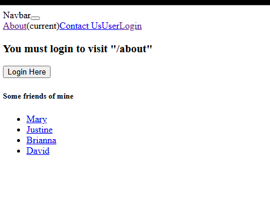
- **Figure 6** - Clicking About redirects to the Login page

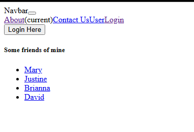
- **Figure 7** - Login page showing "You must login to visit /about"

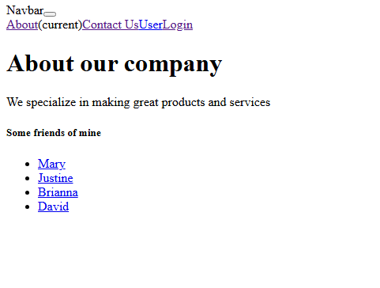
- **Figure 8** - After clicking Login Here, redirected to the About page

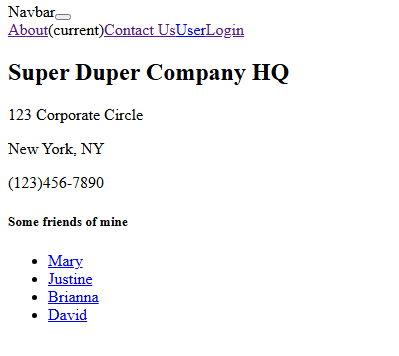
- **Figure 9** - Contact Us page after login

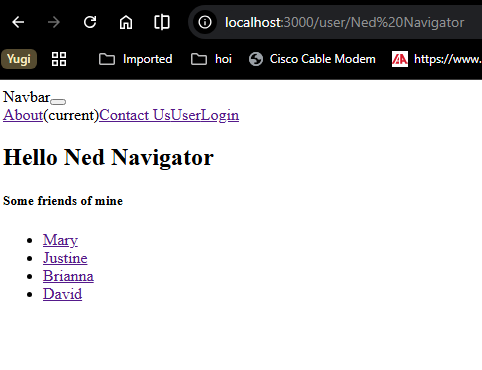
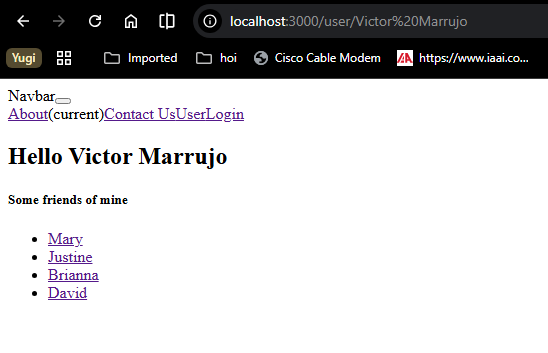
- **Figures 10 and 11** - User page showing dynamic username from URL parameter

**Summary:** React Router v6 connects browser URLs to React components. `BrowserRouter` manages the URL history. `Routes` and `Route` define the page map. `Link` navigates without a page reload. `useNavigate` allows programmatic navigation. `useLocation` reads the current URL and state. `useParams` reads URL parameters. `PrivateRoute` is a pattern for protecting pages that require authentication by redirecting to a login page and saving the requested path in location state.

---

# Part 4 – Navigation Routing in the Music App

React Router was added to the music application and the component hierarchy was refactored to separate concerns more cleanly.

```bash
cd music
npm install react-router-dom
```

## Refactored Component Hierarchy

The `renderedList` helper function was moved out of `App.js` into a dedicated `AlbumList` component. A `SearchAlbum` component was created as the direct parent of both `SearchForm` and `AlbumList`. This makes `App.js` the state manager while the child components handle their own display logic.

### AlbumList.js

```javascript
import React from 'react';
import Card from './Card';
import { useNavigate } from 'react-router-dom';

const AlbumList = (props) => {
  const handleSelectionOne = (albumId) => {
    console.log('Selected ID is ' + albumId);
    props.onClick(albumId, navigator);
  };

  const navigator = useNavigate();

  const albums = props.albumList.map((album) => {
    return (
      <Card
        key={album.id}
        albumId={album.id}
        albumTitle={album.title}
        albumDescription={album.description}
        buttonText='OK'
        imgURL={album.image}
        onClick={handleSelectionOne}
        navigator={navigator}
      />
    );
  });

  return <div className='container'>{albums}</div>;
};

export default AlbumList;
```

### SearchAlbum.js

```javascript
import React from 'react';
import SearchForm from './SearchForm';
import AlbumList from './AlbumList';

const SearchAlbum = (props) => {
  return (
    <div className='container'>
      <SearchForm onSubmit={props.updateSearchResults} />
      <AlbumList
        albumList={props.albumList}
        onClick={props.updateSingleAlbum}
      />
    </div>
  );
};

export default SearchAlbum;
```

### OneAlbum.js - Detail View

```javascript
import React from 'react';

const OneAlbum = (props) => {
  return (
    <div className='container'>
      <h2>Album Details for {props.album.title}</h2>
      <div className='row'>
        <div className='col col-sm-3'>
          <div className='card'>
            
            <div className='card-body'>
              <h5 className='card-title'>{props.album.title}</h5>
              <p className='card-text'>{props.album.description}</p>
              <div className='list-group'>
                <li>Show the album's tracks here</li>
              </div>
              <a href='/#' className='btn btn-primary'>Edit</a>
            </div>
          </div>
        </div>
        <div className='col col-sm-9'>
          <div className='card'><p>Show the lyrics of select track here</p></div>
          <div className='card'><p>Show the YouTube Video of select track here</p></div>
        </div>
      </div>
    </div>
  );
};

export default OneAlbum;
```

### NewAlbum.js - Stub for Activity 7

```javascript
import React from 'react';

const NewAlbum = () => {
  return <div>This is a New Album Form</div>;
};

export default NewAlbum;
```

## Updated App.js with Routing

`App.js` now uses `BrowserRouter`, `Routes`, and `Route` to define three pages. Clicking OK on a card calls `updateSingleAlbum`, which finds the album index, saves it in state, and navigates to `/show/:albumId`:

```javascript
const updateSingleAlbum = (id, navigate) => {
  var indexNumber = 0;
  for (var i = 0; i < albumList.length; ++i) {
    if (albumList[i].albumId === id) indexNumber = i;
  }
  setCurrentlySelectedAlbumId(indexNumber);
  navigate('/show/' + indexNumber);
};

return (
  <BrowserRouter>
    <NavBar />
    <Routes>
      <Route
        exact path='/'
        element={
          <SearchAlbum
            updateSearchResults={updateSearchResults}
            albumList={renderedList}
            updateSingleAlbum={updateSingleAlbum}
          />
        }
      />
      <Route exact path='/new' element={<NewAlbum />} />
      <Route
        exact path='/show/:albumId'
        element={<OneAlbum album={albumList[currentlySelectedAlbumId] || { title: '', description: '', image: '' }} />}
      />
    </Routes>
  </BrowserRouter>
);
```

---

## Stopping Point #4 Screenshots

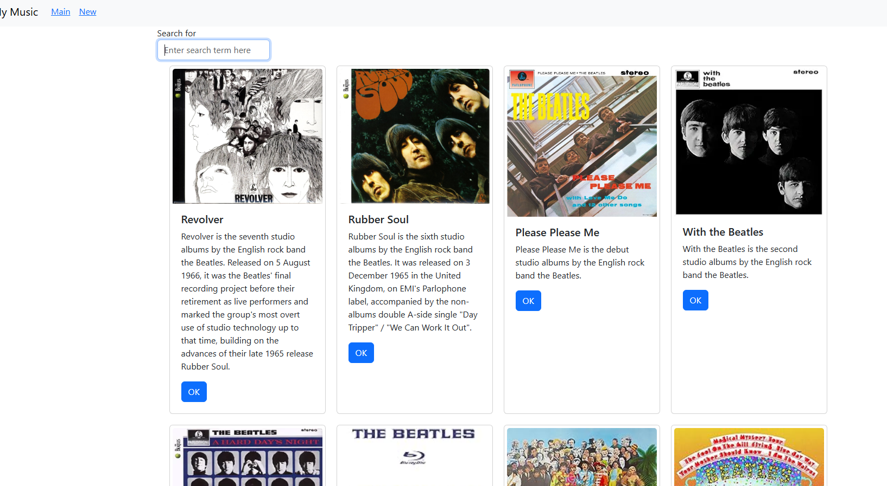
- **Figure 12** - Music app main page with NavBar, search box, and album cards

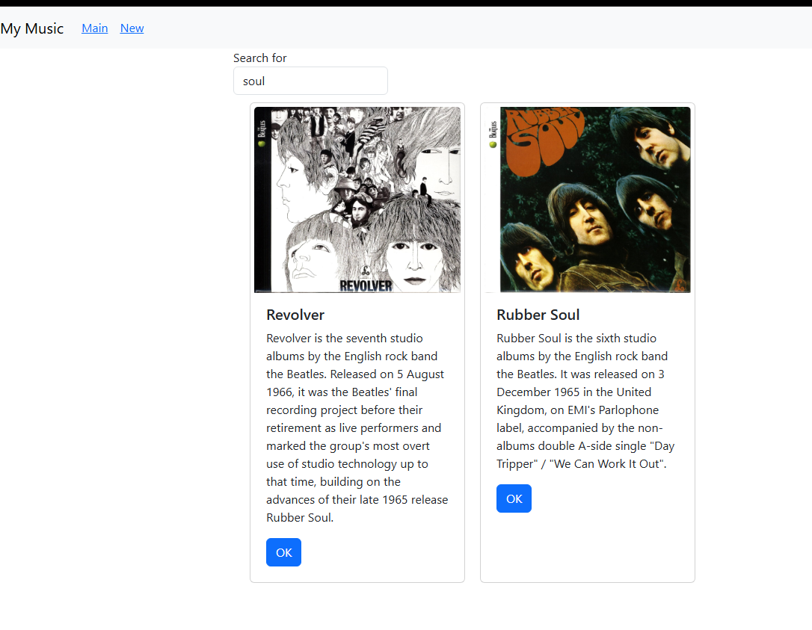
- **Figure 13** - Search results filtered by keyword

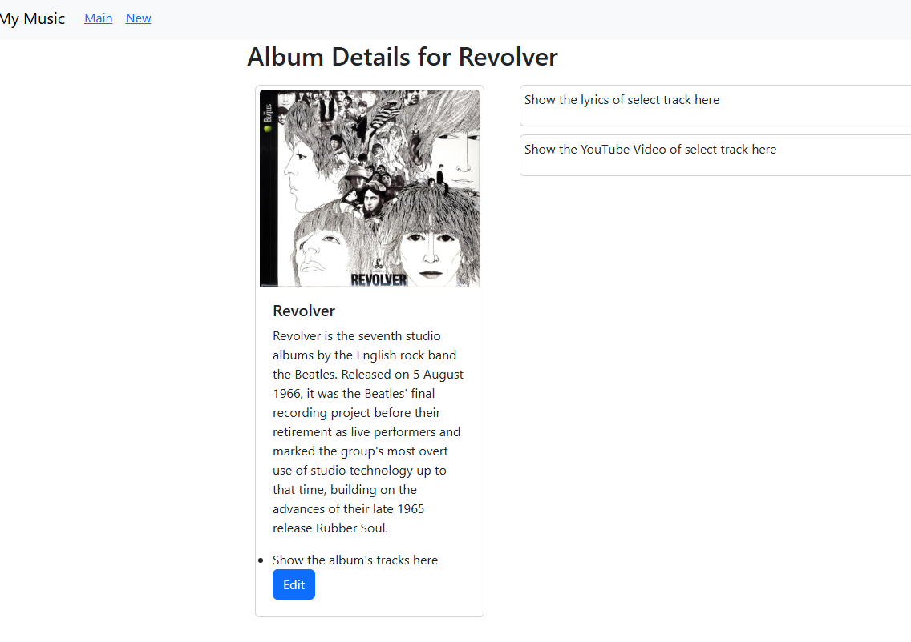
- **Figure 14** - OneAlbum detail view after clicking OK on a card

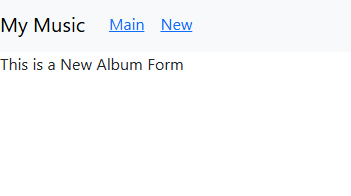
- **Figure 15** - NewAlbum stub page reached via the New NavBar link

**Summary:** React Router was applied to the music application by wrapping the return of `App.js` in `BrowserRouter` and defining three routes: the main search/album list at `/`, a stub new album form at `/new`, and an album detail view at `/show/:albumId`. The component hierarchy was refactored by extracting `AlbumList` and `SearchAlbum` from `App.js`, keeping `App` as the state manager while delegating display and list rendering to child components. `useNavigate` inside `AlbumList` allows programmatic navigation to the detail page when the user clicks a card button.