# CST-391: JavaScript Web Application Development

- Activity 7: Dynamic Components, Tracks, and Album CRUD
- Author: **Victor Manuel Marrujo Verdugo**
- College of Humanities and Social Sciences, Grand Canyon University
- Professor Bobby Estey
- May 24th, 2026

---

# Introduction

This activity continued building the React music application by adding dynamic component management, track display, and full album CRUD functionality. A mini app called `blog` was built first to demonstrate dynamically adding and removing components from a list. That pattern was then applied back to the music application to implement the `TracksList`, `TrackTitle`, `TrackLyrics`, and `TrackVideo` components in the `OneAlbum` view. The `NewAlbum` stub from Activity 6 was replaced with a fully functional `EditAlbum` component that handles both creating and editing albums depending on whether an album prop is passed to it. The `Card` component was updated with an Edit button, and `App.js` was updated with routing for both `/new` and `/edit/:albumId` paths.

---

# Mini App #3 - Dynamic Components Demo (Blog App)

A new mini app called `blog` was created to demonstrate dynamically adding and removing items from a list before applying the pattern to the music application.

```bash
npx create-react-app blog
cd blog
npm start
```

## Post.js - Single Blog Post with Delete

Each post is its own component. The `onDelete` prop receives a callback from the parent `App` component. The `() =>` arrow function syntax on the `onClick` allows the `postNumber` parameter to be passed to the parent:

```javascript
import React from 'react';
import './Post.css';

const Post = (props) => {
  return (
    <div className='post'>
      <h3>{props.title}</h3>
      <p>{props.body}</p>
      {/* Arrow function passes postNumber so parent knows which post to remove */}
      <button
        className='delete-btn'
        onClick={() => props.onDelete(props.postNumber)}
      >
        Delete
      </button>
    </div>
  );
};

export default Post;
```

## AddPost.js - Controlled Component

`AddPost` is a **controlled component** , meaning that every `onChange` event updates state, keeping the component's state in sync with the input values at all times. This makes it possible to send the current values back to `App` via the `onAdd` callback when the button is clicked:

```javascript
import React, { useState } from 'react';

const AddPost = (props) => {
  const [title, setTitle] = useState('');
  const [body, setBody] = useState('');

  const handleTitleChange = (event) => setTitle(event.target.value);
  const handleBodyChange = (event) => setBody(event.target.value);

  const handleClick = () => {
    if (title.trim() === '' || body.trim() === '') return;
    props.onAdd(title, body);
    setTitle('');
    setBody('');
  };

  return (
    <div>
      <h2>Add New Post</h2>
      <input type='text' value={title} onChange={handleTitleChange} placeholder='Post title' />
      <textarea value={body} onChange={handleBodyChange} placeholder='Write your post here...' />
      <button onClick={handleClick}>Add Post</button>
    </div>
  );
};

export default AddPost;
```

## App.js - Managing State for Add and Delete

`App` owns the `postList` state and all methods that modify it. It passes `handleDeletePost` down to `Post` and `handleAddPost` down to `AddPost` as props. The child components call these callbacks, and `App` updates state, which triggers a re-render of the list.

The `handleDeletePost` method uses `filter` to return a new array without the deleted post. The `handleAddPost` method uses the **spread syntax** (`...`) to append a new post without mutating the existing array:

```javascript
import React, { useState } from 'react';
import Post from './Post';
import AddPost from './AddPost';

const App = () => {
  const [postList, setPostList] = useState([
    { postId: 1, title: 'First Post', body: 'This is my first blog post!' },
    { postId: 2, title: 'Second Post', body: 'This is my second blog post!' },
    { postId: 3, title: 'Third Post', body: 'This is my third blog post!' },
  ]);

  const [postId, setPostId] = useState(4);

  // Filters out the deleted post - returns a new array without mutating state
  const handleDeletePost = (id) => {
    const updatedPostList = postList.filter((post) => post.postId !== id);
    setPostList(updatedPostList);
  };

  // Spread syntax (...) appends newPost without mutating the existing array
  const handleAddPost = (title, body) => {
    const newPost = { postId: postId, title: title, body: body };
    setPostList((currentList) => [...currentList, newPost]);
    setPostId(postId + 1);
  };

  const posts = postList.map((post) => {
    return (
      <Post
        key={post.postId}
        postNumber={post.postId}
        title={post.title}
        body={post.body}
        onDelete={handleDeletePost}
      />
    );
  });

  return (
    <div>
      <h1>My Blog</h1>
      <AddPost onAdd={handleAddPost} />
      <hr />
      {posts}
    </div>
  );
};

export default App;
```

## Key Concepts - Spread Syntax and Controlled Components

The `...` spread syntax compiles to an iterable that creates a comma-separated list of the array's contents. Using it inside `setPostList` creates a brand new array with all existing posts plus the new one, rather than mutating the original which is required in React because mutating state directly does not trigger a re-render.

A **controlled component** is any input whose value is driven by React state. Every keystroke calls an `onChange` handler that updates state, and the `value` attribute reads from that state. This means the component always reflects the current state and the parent can access the current value at any time via the callback.

---

## Stopping Point #5 Screenshots

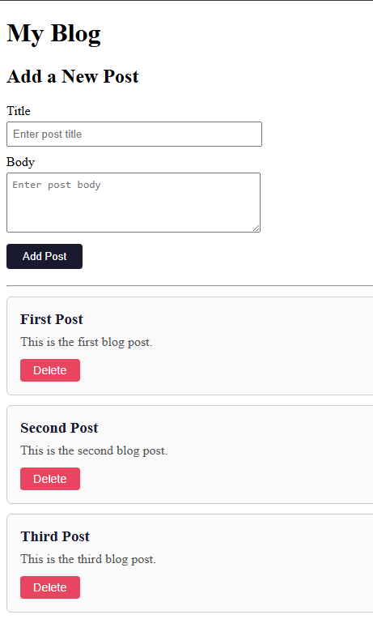
- **Figure 1** - Blog app with three initial posts

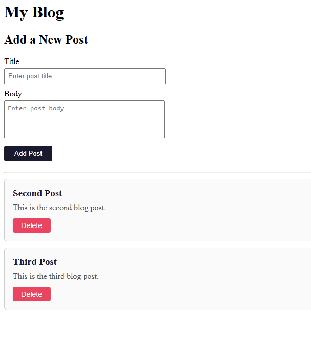
- **Figure 2** - Blog app after deleting a post

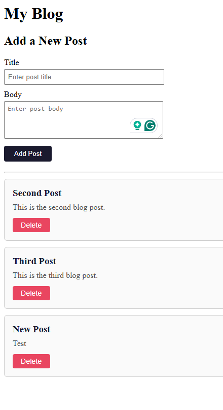
- **Figure 3** - Blog app after adding a new post using the AddPost form

**Summary:** This exercise demonstrated how to dynamically add and remove components from a page. The `App` component owns the list state and all modification methods. Child components receive callbacks as props and call them to signal state changes upward. The spread syntax creates new arrays without mutation, which is required for React to detect the change and re-render. Controlled components keep input state in sync with React state on every keystroke.

---

# Part 5 - Tracks, Lyrics, and Video in OneAlbum

The `OneAlbum` component was upgraded from a static placeholder into an interactive view with four new child components.

## Component Hierarchy

```
OneAlbum
  ├── TracksList         (container - maps tracks to TrackTitle components)
  │     └── TrackTitle   (single track - onClick sets selectedTrack in OneAlbum)
  ├── TrackLyrics        (displays lyrics of selectedTrack)
  └── TrackVideo         (displays YouTube video of selectedTrack)
```

## TrackTitle.js

```javascript
import React from 'react';

const TrackTitle = (props) => {
  return (
    <li
      className='list-group-item list-group-item-action'
      style={{ cursor: 'pointer' }}
      onClick={() => props.onSelect(props.track)}
    >
      {props.track.number}. {props.track.title}
    </li>
  );
};

export default TrackTitle;
```

## TracksList.js

```javascript
import React from 'react';
import TrackTitle from './TrackTitle';

const TracksList = (props) => {
  if (!props.tracks || props.tracks.length === 0) {
    return <p className='text-muted'>No tracks available.</p>;
  }

  const trackItems = props.tracks.map((track) => {
    return (
      <TrackTitle
        key={track.trackId}
        track={track}
        onSelect={props.onSelectTrack}
      />
    );
  });

  return <ul className='list-group list-group-flush'>{trackItems}</ul>;
};

export default TracksList;
```

## TrackLyrics.js

```javascript
import React from 'react';

const TrackLyrics = (props) => {
  if (!props.track) {
    return <div className='card p-3'><p className='text-muted'>Select a track to see lyrics.</p></div>;
  }
  return (
    <div className='card p-3'>
      <h6 className='card-title'>Lyrics - {props.track.title}</h6>
      <p className='card-text' style={{ whiteSpace: 'pre-line' }}>
        {props.track.lyrics ? props.track.lyrics : 'No lyrics available for this track.'}
      </p>
    </div>
  );
};

export default TrackLyrics;
```

## TrackVideo.js

```javascript
import React from 'react';

const TrackVideo = (props) => {
  if (!props.track) {
    return <div className='card p-3'><p className='text-muted'>Select a track to see the video.</p></div>;
  }

  // Converts YouTube watch URL to embed URL for iframe use
  const getEmbedUrl = (url) => {
    if (!url) return null;
    if (url.includes('watch?v=')) return url.replace('watch?v=', 'embed/');
    return url;
  };

  const embedUrl = getEmbedUrl(props.track.video);

  return (
    <div className='card p-3'>
      <h6 className='card-title'>Video - {props.track.title}</h6>
      {embedUrl ? (
        <div className='ratio ratio-16x9'>
          <iframe src={embedUrl} title={props.track.title} allowFullScreen></iframe>
        </div>
      ) : (
        <p className='text-muted'>No video available for this track.</p>
      )}
    </div>
  );
};

export default TrackVideo;
```

## Updated OneAlbum.js

`OneAlbum` now manages a `selectedTrack` state variable. Clicking a track in `TracksList` calls `handleSelectTrack`, which updates `selectedTrack` and causes `TrackLyrics` and `TrackVideo` to re-render with the new track's content:

```javascript
import React, { useState } from 'react';
import TracksList from './TracksList';
import TrackLyrics from './TrackLyrics';
import TrackVideo from './TrackVideo';

const OneAlbum = (props) => {
  const [selectedTrack, setSelectedTrack] = useState(null);

  const handleSelectTrack = (track) => {
    setSelectedTrack(track);
  };

  return (
    <div className='container mt-3'>
      <h2>Album Details for {props.album.title}</h2>
      <div className='row'>
        <div className='col col-sm-3'>
          <div className='card'>
            
            <div className='card-body'>
              <h5 className='card-title'>{props.album.title}</h5>
              <p className='card-text'>{props.album.description}</p>
            </div>
            <TracksList tracks={props.album.tracks} onSelectTrack={handleSelectTrack} />
          </div>
        </div>
        <div className='col col-sm-9'>
          <TrackLyrics track={selectedTrack} />
          <div className='mt-3'>
            <TrackVideo track={selectedTrack} />
          </div>
        </div>
      </div>
    </div>
  );
};

export default OneAlbum;
```

---

## Stopping Point #5 Screenshots

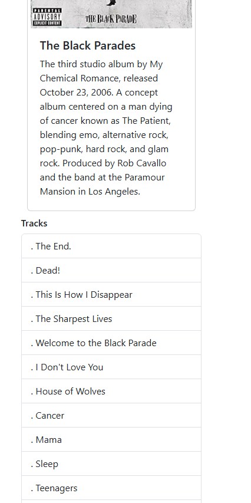
- **Figure 4** - OneAlbum view with track list displayed

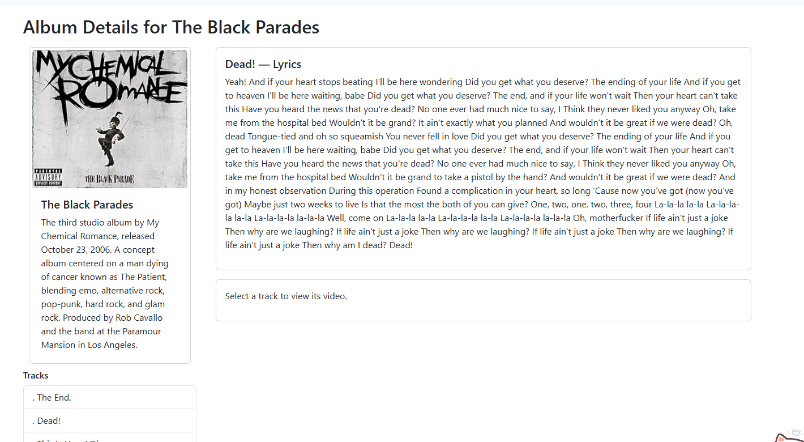
- **Figure 5** - OneAlbum after clicking a track - lyrics panel updates

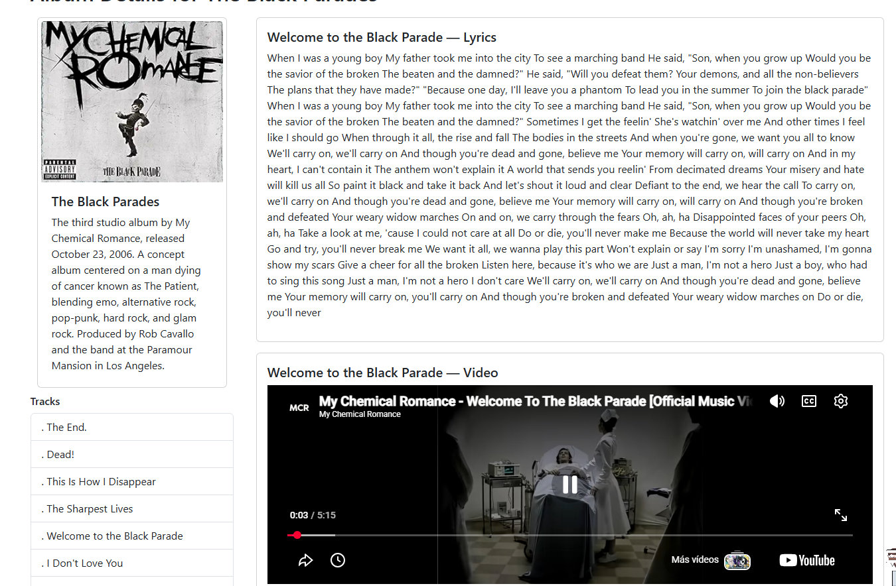
- **Figure 6** - OneAlbum after clicking a track with a video URL - video panel updates

---

# Part 6 - Create New Album (EditAlbum in Create Mode)

The `NewAlbum` stub from Activity 6 was replaced with a fully functional `EditAlbum` component. A controlled component pattern is used for every form field, each input has a `value` bound to state and an `onChange` handler that updates that state on every keystroke.

## EditAlbum.js - Create Mode

When no `props.album` is passed, `EditAlbum` initializes all fields to empty strings and uses `dataSource.post` to send a POST request to the API:

```javascript
const isEditMode = props.album != null;

const [title, setTitle] = useState(isEditMode ? props.album.title : '');
const [artist, setArtist] = useState(isEditMode ? props.album.artist : '');
const [description, setDescription] = useState(isEditMode ? props.album.description : '');
const [year, setYear] = useState(isEditMode ? props.album.year : '');
const [image, setImage] = useState(isEditMode ? props.album.image : '');

const saveAlbum = async (album) => {
  try {
    if (isEditMode) {
      await dataSource.put('/albums', album);
    } else {
      await dataSource.post('/albums', album);
    }
    props.onEditAlbum();
  } catch (error) {
    console.error('Error saving album:', error);
  }
};

const handleFormSubmit = (event) => {
  event.preventDefault();
  const album = {
    albumId: isEditMode ? props.album.albumId : null,
    title, artist, description, year, image,
    tracks: isEditMode ? props.album.tracks : [],
  };
  saveAlbum(album);
};
```

The page title also switches based on mode:

```javascript
<h2>{isEditMode ? 'Edit Album' : 'Create New Album'}</h2>
```

## Updated App.js Routes

`App.js` now defines four routes. The `/new` route renders `EditAlbum` without an `album` prop (create mode). The `/edit/:albumId` route renders `EditAlbum` with the selected album passed as a prop (edit mode):

```javascript
<Route exact path='/new' element={<EditAlbum onEditAlbum={onEditAlbum} />} />
<Route exact path='/edit/:albumId'
  element={
    <EditAlbum
      album={albumList[currentlySelectedAlbumId]}
      onEditAlbum={onEditAlbum}
    />
  }
/>
```

The `onEditAlbum` callback reloads the album list from the API after a save:

```javascript
const onEditAlbum = () => {
  loadAlbums();
  console.log('Album saved - reloading list');
};
```

---

## Stopping Point #6 Screenshots

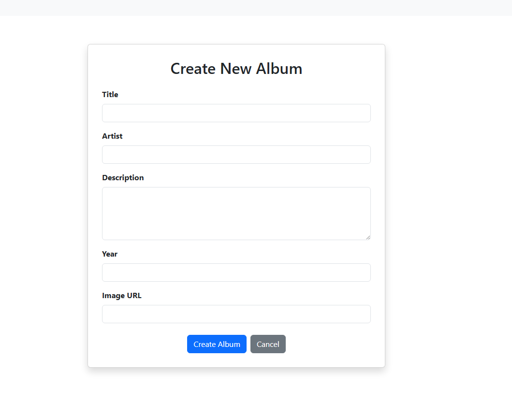
- **Figure 7** - Create New Album form (empty fields, create mode)

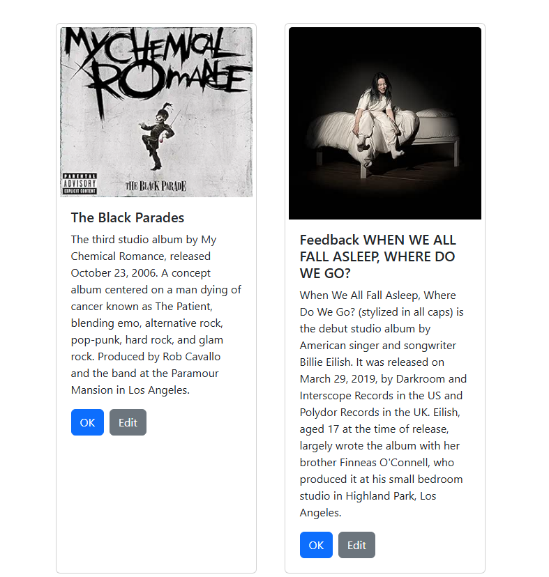
- **Figure 8** - Main page showing the newly created album in the list after filling in the form and clicking Create Album

---

# Part 7 - Edit an Album (EditAlbum in Edit Mode)

Rather than creating a separate `EditAlbum` component by copying `NewAlbum`, the single `EditAlbum` component handles both modes. This avoids duplicating code that would need to be maintained in two places. The mode is determined entirely by whether `props.album` is present.

## Card.js - Edit Button Added

An Edit button was added to each `Card` component. Clicking OK navigates to `/show/:albumId` and clicking Edit navigates to `/edit/:albumId`. Both pass the album ID and navigator to the parent via the `onClick` prop with a `path` parameter:

```javascript
const handleButtonClick = () => {
  props.onClick(props.albumId, props.navigator);
};

const handleEditClick = () => {
  props.onClick(props.albumId, props.navigator, 'edit');
};

return (
  <div className='card' style={{ width: '18rem' }}>
    
    <div className='card-body'>
      <h5 className='card-title'>{props.albumTitle}</h5>
      <p className='card-text'>{props.albumDescription}</p>
      <button className='btn btn-primary me-2' onClick={handleButtonClick}>
        {props.buttonText}
      </button>
      <button className='btn btn-secondary' onClick={handleEditClick}>
        Edit
      </button>
    </div>
  </div>
);
```

## updateSingleAlbum - Show vs Edit Path

`updateSingleAlbum` in `App.js` was updated to accept a `path` parameter. The default is `show` for the OK button and `edit` for the Edit button:

```javascript
const updateSingleAlbum = (id, navigate, path = 'show') => {
  var indexNumber = 0;
  for (var i = 0; i < albumList.length; ++i) {
    if (albumList[i].albumId === id) indexNumber = i;
  }
  setCurrentlySelectedAlbumId(indexNumber);
  navigate('/' + path + '/' + indexNumber);
};
```

---

## Stopping Point #7 Screenshots

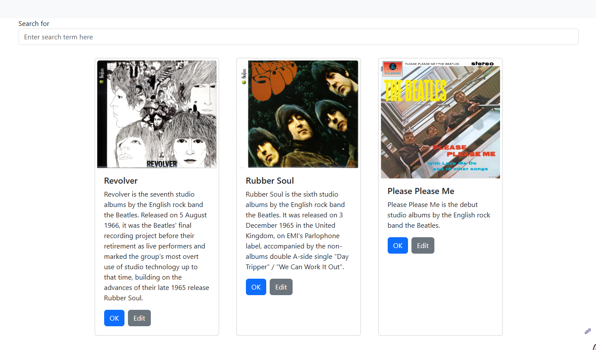
- **Figure 9** - Main page showing album cards each with an OK and Edit button

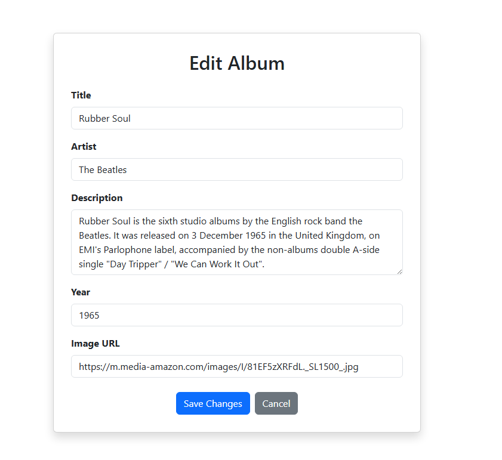
- **Figure 10** - Edit Album form pre-populated with existing album data

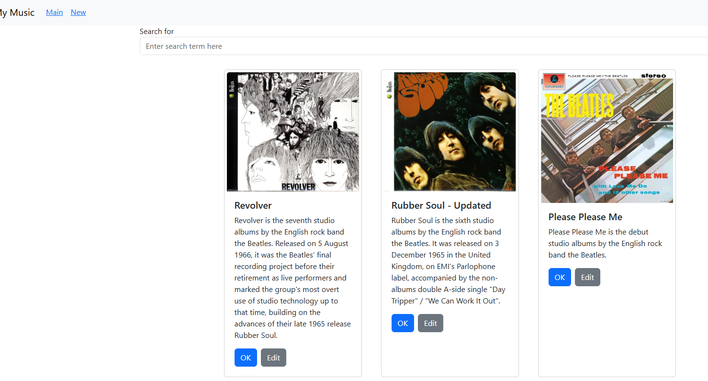
- **Figure 11** - Main page after saving edits - album list reflects the changes

---

# Summary

**Stopping Point #5 - Dynamic Components:** The blog mini app demonstrated the core pattern for dynamically managing a list of components. `App` owns the list state and all modification methods. Child components call parent callbacks via props to signal add and delete operations. The spread syntax creates new arrays without mutating state. Controlled components keep every input synchronized with React state on each keystroke. These same patterns were applied to `OneAlbum` with the four track sub-components - clicking a `TrackTitle` updates `selectedTrack` state in `OneAlbum`, which cascades down to re-render `TrackLyrics` and `TrackVideo`.

**Stopping Point #6 - Create New Album:** The `NewAlbum` stub was replaced with a fully functional `EditAlbum` controlled component form. Each input field is bound to its own `useState` variable and updated on `onChange`. On submit, `handleFormSubmit` builds the album object and calls `dataSource.post` to send it to the MusicAPI. The `onEditAlbum` callback in `App.js` reloads the album list after a successful save.

**Stopping Point #7 - Edit an Album:** Rather than duplicating the form into a separate component, `EditAlbum` was modified to detect its mode via the presence of `props.album`. In edit mode, form fields are pre-populated from the existing album and `dataSource.put` is used instead of `dataSource.post`. The `Card` component was updated with an Edit button that passes `'edit'` as the path parameter to `updateSingleAlbum`, routing to `/edit/:albumId` instead of `/show/:albumId`.