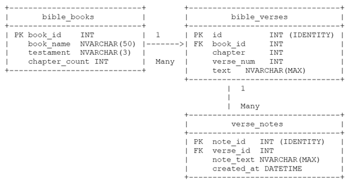

# CST-391: JavaScript Web Application Development 

- Milestone Project: Bible Verse Searcher
- Victor Manuel Marrujo Verdugo
- College of Humanities and Social Sciences, Grand Canyon University
- Professor Bobby Estey
- April 26th, 2026

# Instructor Feedback

## Milestone 2 Instructor Feedback

- No instructor feedback was provided for Milestone 2. Feedback is expected beginning with the graded return of this Milestone 3 submission and will be incorporated into Milestone 4.

## Response to Feedback

- How Feedback Was Addressed
- How Feedback Was Addressed
Because no formal feedback was received for Milestone 2, no instructor-directed changes were required. The following self-directed refinements were made for Milestone 3:
•	Framework switched from ASP.NET Core to Node.js/Express/TypeScript per M3 requirements.
•	Full REST API implemented with Express 4 and mysql2 connection pool.
•	All 14 endpoints tested in Postman.
•	Design updates table added tracking all M3 changes vs. M2 design.
•	Known issues documented with TO DO items for M4.

Part 1 – Introduction: 
The Bible Verse Searcher is a web-based application designed to help users search, explore, and annotate Bible verses. The system allows users to perform keyword searches, browse scripture by book and chapter, and attach personal notes to verses.

The application follows an N-Layer architecture using a Node.js/Express.js back-end REST API and a MySQL relational database, with two independent front-end implementations built in Angular and React. Concerns are cleanly separated between presentation, business logic (service layer), and data access layers.

This project aligns with a Christian worldview by providing a tool for Bible study, reflection, and spiritual growth. Users such as pastors, students, and individuals can efficiently navigate scripture and store personal insights.

GitHub Repository link:
https://github.com/Demoyuki/bible-api 

## Screencast link

- [Video Part 1](https://www.loom.com/share/b22418c1293b463fb96eb61c045ba221)

- [Video Part 2](https://www.loom.com/share/6bdd96b1e0fe4bc996abe4f8559c0370)

## Part 2 – Functionality Requirements (User Stories)

- The following user stories define the full scope of the Bible Verse Searcher. Stories are prioritized as High (MVP), Medium (desired), or Low (stretch). 

|ID|User Story|Priority|Notes|
|--|--|--|--|
|US-01|As a user, I want to search for Bible verses by keyword so that I can quickly find relevant scripture.|High|Search page + results|
US-02	As a user, I want to filter search results by Old or New Testament so that I can narrow my search.	High	Checkbox filters on Search page
US-03	As a user, I want to view all verses in a selected book and chapter so that I can read scripture in context.	High	Reference page + results
US-04	As a user, I want to view detailed information about a specific verse so that I can study it more deeply.	High	Verse Details page
US-05	As a user, I want to add a note to a verse so that I can record personal insights or reflections.	High	Add Note form on Details page
US-06	As a user, I want to view all previously added notes on a verse so that I can revisit my thoughts.	High	Saved Notes section on Details page
US-07	As a user, I want to edit an existing note so that I can correct or update my reflections.	Medium	Edit Note inline on Details page
US-08	As a user, I want to delete a note so that I can remove entries I no longer find useful.	Medium	Delete button with confirmation
US-09	As a user, I want the system to store and retrieve data reliably so that my notes are never lost.	High	MySQL persistence via REST API
US-10	As a user, I want to see results sorted by relevance or book order so that I can find the best match quickly.	Medium	Sort control on Results page

Part 3 – Initial Database Design - ER Diagram:

Column	Data Type	Constraints
book_id	INT	PK, NOT NULL
book_name	NVARCHAR(50)	NOT NULL
testament	NVARCHAR(3)	OT / NT
chapter_count	INT	NOT NULL
3.1 - bible_books table:

3.2 - bible_verses table:
Column	Data Type	Constraints
id	INT	PK, IDENTITY
book_id	INT	FK -> bible_books
chapter	INT	NOT NULL
verse_num	INT	NOT NULL
text	NVARCHAR(MAX)	NOT NULL

3.3 - verse_notes table:
Column	Data Type	Constraints
note_id	INT	PK, IDENTITY
verse_id	INT	FK -> bible_verses
note_text	NVARCHAR(MAX)	NOT NULL
created_at	DATETIME	DEFAULT GETDATE()

## 3.4 - ER Diagram
The schema uses three tables: bible_books, bible_verses, and verse_notes. The diagram below shows the entity relationships and the data types used (satisfying the requirement for at least three distinct types).
 

## 3.5 - Table relationships
•	bible_books (1) ──◂▸ (many) bible_verses: One book contains many verses.
•	bible_verses (1) ──◂▸ (many) verse_notes: One verse can have many user notes.
•	Foreign key constraints enforced with CASCADE DELETE on verse_notes (deleting a verse removes its notes).

3.6  Data Types Summary:
•	INT: all primary and foreign keys, chapter and verse numbers (exact numeric identifiers).
•	NVARCHAR(n) / NVARCHAR(MAX): book names, testament codes, verse text, note text (Unicode strings).
•	DATETIME: note timestamp (point-in-time value, enables sorting and audit trail).

3.7  SQL Implementation:
CREATE TABLE bible_books (
  book_id INT NOT NULL, book_name VARCHAR(50) NOT NULL,
  testament VARCHAR(3) NOT NULL, chapter_count INT NOT NULL,
  PRIMARY KEY (book_id)
) ENGINE=InnoDB DEFAULT CHARSET=utf8mb4;

CREATE TABLE bible_verses (
  id INT NOT NULL AUTO_INCREMENT, book_id INT NOT NULL,
  chapter INT NOT NULL, verse_num INT NOT NULL, text VARCHAR(800) NOT NULL,
  PRIMARY KEY (id),
  FOREIGN KEY (book_id) REFERENCES bible_books(book_id) ON DELETE CASCADE,
  FULLTEXT KEY ft_verse_text (text)
) ENGINE=InnoDB DEFAULT CHARSET=utf8mb4;

CREATE TABLE verse_notes (
  note_id INT NOT NULL AUTO_INCREMENT, verse_id INT NOT NULL,
  note_text VARCHAR(800) NOT NULL,
  created_at DATETIME NOT NULL DEFAULT CURRENT_TIMESTAMP,
  updated_at DATETIME NOT NULL DEFAULT CURRENT_TIMESTAMP ON UPDATE CURRENT_TIMESTAMP,
  PRIMARY KEY (note_id),
  FOREIGN KEY (verse_id) REFERENCES bible_verses(id) ON DELETE CASCADE
) ENGINE=InnoDB DEFAULT CHARSET=utf8mb4;

Part 4 — REST API Design:
The Express.js back-end exposes three resource collections: /api/verses, /api/books, and /api/notes. The API follows REST conventions: plural nouns name resources; URL paths hierarchically refine the resource; HTTP verbs (GET, POST, PUT, DELETE) express intent. The API layer is a façade over service/business-logic classes.
4.1 - Books Endpoints
Method	Endpoint	Operation	Request Body	Response
GET	/api/books	List all 66 books	None	200 + array of book objects
GET	/api/books/:id	Get single book	None	200 + book object | 404
GET	/api/books/:id/chapters	Chapter count for book	None	200 + { bookId, chapterCount }
4.2 - Verses Endpoints
Method	Endpoint	Operation	Request Body	Response
GET	/api/verses	Search / list all	?q=keyword&testament=OT|NT	200 + array
GET	/api/verses?book=:id&chapter=:n	Reference browse	Query params	200 + array
GET	/api/verses/:id	Single verse	None	200 + verse | 404
POST	/api/verses	Create verse	{ book_id, chapter, verse_num, text }	201 + verse | 400
PUT	/api/verses/:id	Update verse	Any subset of verse fields	200 + verse | 404
DELETE	/api/verses/:id	Delete verse	None	204 No Content | 404
4.3 - Notes Endpoints
Method	Endpoint	Operation	Request Body	Response
GET	/api/verses/:id/notes	All notes for verse	None	200 + array of notes
GET	/api/verses/:id/notes/:nid	Single note	None	200 + note | 404
POST	/api/verses/:id/notes	Create note	{ note_text }	201 + note | 400 | 404
PUT	/api/verses/:id/notes/:nid	Update note	{ note_text }	200 + note | 404
DELETE	/api/verses/:id/notes/:nid	Delete note	None	204 No Content | 404
GET	/api/verses/:id/notes	All notes for verse	None	200 + array of notes
4.4 - REST Conventions Applied
•	Plural nouns as resources: /verses, /books, /notes, and never /getVerse or /searchBible.
•	Hierarchical paths: /api/verses/:id/notes drills from a verse resource into its child notes collection.
•	HTTP verbs carry intent: GET retrieves, POST creates, PUT updates, DELETE removes, and no action verbs in URLs.
•	Query parameters for search/filter: ?q=keyword&testament=OT keeps the base resource path clean.
•	Consistent status codes: 200 OK, 201 Created, 204 No Content, 400 Bad Request, 404 Not Found.

4.5 - REST API Testing
All 14 endpoints below are implemented and tested in Postman..
Base URL: http://localhost:3000/api
 
Figure 1: Screenshot of the Postman testing Books Endpoints
This figure shows the Postman app successfully accessing /api/books and showing all books in the database.
 
Figure 2: Screenshot of the Postman testing Books Endpoints
This figure shows the Postman app successfully accessing /api/books/:id and showing a specific book whose ID is equal to the searched value.

 
Figure 3: Screenshot of the Postman testing Books Endpoints
This figure shows the Postman app successfully accessing /api/books/:id/chapters and showing all the available chapters for a specific book whose ID is equal to the searched value.
 
Figure 4: Screenshot of the Postman testing Verses Endpoints
This figure shows the Postman app successfully accessing /api/verses and showing all the available verses

 
Figure 5: Screenshot of the Postman testing Verses Endpoints
This figure shows the Postman app successfully accessing /api/verses?book=:id&chapter=:n and showing all verse within the given book and chapter available.

 .
Figure 6: Screenshot of the Postman testing Verses Endpoints
This figure shows the Postman app successfully accessing /api/verses/:id and showing a specific verse whose ID is equal to the searched value.

 
Figure 7: Screenshot of the Postman testing Verses Endpoints
This figure shows the Postman app successfully accessing /api/verses/ and adding a new verse into the database.
 
Figure 8: Screenshot of the Postman testing Verses Endpoints
This figure shows the Postman app successfully accessing /api/verses/10 and updating the text of the new verse we just added into the database.

 
Figure 9: Screenshot of the Postman testing Verses Endpoints
This figure shows the Postman app successfully accessing /api/verses/10 and deleted the new verse we just added into the database.

 
Figure 10: Screenshot of the Postman testing Notes Endpoints
This figure shows the Postman app successfully accessing /api/verses/1/Notes and showing all available notes for this verse on the database.

 
Figure 11: Screenshot of the Postman testing Notes Endpoints
This figure shows the Postman app successfully accessing /api/verses/1/Notes/1 and showing the note with the given id for this verse on the database.
 
Figure 12: Screenshot of the Postman testing Notes Endpoints
This figure shows the Postman app successfully accessing /api/verses/1/Notes and creating a new note with the given value for this verse on the database.

 
Figure 13: Screenshot of the Postman testing Notes Endpoints
This figure shows the Postman app successfully accessing /api/verses/id/notes/:nid and updating the text of the new note we just added into the database.

 
Figure 14: Screenshot of the Postman testing Notes Endpoints
This figure shows the Postman app successfully accessing /api/verses/id/notes/:nid and deleting the text of the new note we just added into the database.

Part 5 – Initial UI Sitemap - Logical layout and flow of application pages/modules:
5.1 – Page descriptions:
The project will consist of the following pages, each dedicated to its described function:
Home Page
•	Main landing page of the application
•	Provides navigation to Search and Reference features
Search Page
•	Allows users to enter a keyword or phrase
•	Includes filters for Old Testament and New Testament
Search Results Page
•	Displays a list of verses matching the search criteria
•	Each result includes a link to view more details
Reference Page
•	Allows users to select a Bible book and chapter
•	Provides dropdown menus for structured navigation
Reference Results Page
•	Displays all verses from the selected book and chapter
•	Each verse includes a link to view more details
Verse Details Page
•	Displays the full verse text
•	Shows all user-created notes associated with the verse
•	Provides a form to add a new note
Add Note (Functionality within Verse Details Page)
•	Allows users to submit a personal note tied to a specific verse
•	Saves the note to the database with a timestamp.

5.2 - Application Flow Summary
Home → Search → Search Results → Verse Details
Home → Reference → Reference Results → Verse Details

5.3 - Access and Flow Notes
•	The Home Page is the main entry point of the application 
•	Users can navigate to either: 
o	Search workflow 
o	Reference workflow 
•	Both workflows eventually lead to the Verse Details Page 
•	The Verse Details Page acts as the final interaction point where users can view and add notes 

Part 6 – Initial UI Wireframes - Low-fidelity user interface designs:

6.1 - Search Page:
URL: /Search  |  Method: GET + POST
  BIBLE VERSE SEARCHER                              [Home] [Reference]
  ───────────────────────────────────────────────────────
  Search Term: [ _________________________________ ]

  [x] Old Testament    [x] New Testament

  [ Search ]

6.2 - Search Results Page:
URL: /Search/Results  |  Displays list of matched verses
  Results for: "grace"                              [New Search]
  Sort by: [Relevance v]
──────────────────────────────────────────────────────────────────────────────
  Jhn 1:14  | And the Word was made flesh...    [ Details ]
  Rom 5:2   | By whom also we have access...    [ Details ]
  Eph 2:8   | For by grace are ye saved...      [ Details ]

6.3 - Reference Page:
URL: /Reference  |  Drop-down selectors for Book and Chapter
  BIBLE VERSE SEARCHER                              [Home] [Search]
  ───────────────────────────────────────────────────────
  SELECT BOOK:    [ Genesis          v ]
  SELECT CHAPTER: [ 1                v ]

  [ Go ]

6.4 - Reference Results Page:
URL: /Reference/Results  |  Table of all verses in selected chapter
  BIBLE VERSE SEARCHER                              [Home] [Search]
  ─────────────────────────────────────────────────────────────────
  SELECT BOOK:    [ Genesis          v ]
  SELECT CHAPTER: [ 1                v ]

  [ Go ]

6.5 - Single Verse Page / Details Page:
URL: /Verse/Details/{id}  |  Displays verse text, existing notes, and add-note form
  [Jhn 3:3 KJV] Jesus answered and said unto him...          [< Back]
  ───────────────────────────────────────────────────────
  --- Saved Notes ---
  Jhn 3:3 | "Famous born again verse"  (2026-04-12)  [Edit] [Delete]
  ───────────────────────────────────────────────────────
  --- Add a Note ---
  [ Note Text Area _________________________________ ]
  [ Save Note ]

6.6 - Single Verse Page / Details Page:
Activated by clicking [Edit] on a saved note

  --- Editing Note ---
  [ Famous born again verse — about being spiritually reborn ]

  [ Cancel ]      [ Save Changes ]

Part 7 – Initial UML Classes - The back-end services and object model class designs:
7.1 - Model Layer:
Class	Property / Method	Type / Return	Description
BibleVerse	Id	int	Primary key
BibleVerse	BookId	int	Foreign key to Book
BibleVerse	Chapter	int	Chapter number
BibleVerse	VerseNum	int	Verse number
BibleVerse	Text	string	Verse text content
BibleBook	BookId	int	Primary key
BibleBook	BookName	string	Full book name
BibleBook	Testament	string	Old or New
VerseNote	NoteId	int	Primary key
VerseNote	VerseId	int	FK to BibleVerse
VerseNote	NoteText	string	User comment text
VerseNote	CreatedAt	DateTime	Timestamp
SearchViewModel	SearchTerm	string	User search input
SearchViewModel	OldTestament	bool	Include OT flag
SearchViewModel	NewTestament	bool	Include NT flag
SearchViewModel	Results	List<BibleVerse>	Search results list
7.2 - Data Access Layer (DAO Pattern):
Class / Interface	Method	Description
IBibleVerseDAO	GetVerseById(id)	Returns single verse by ID
IBibleVerseDAO	SearchVerses(term, ot, nt)	Full-text search with filters
IBibleVerseDAO	GetVersesByChapter(bookId, ch)	All verses in a chapter
IBibleBookDAO	GetAllBooks()	Returns all 66 books
IBibleBookDAO	GetChapterCount(bookId)	Chapter count for book
IVerseNoteDAO	GetNotesByVerseId(verseId)	Fetch notes for verse
IVerseNoteDAO	AddNote(
note)	Insert new note
SqlBibleVerseDAO	SearchVerses(...)	Implements IBibleVerseDAO
SqlBibleBookDAO	GetAllBooks()	Implements IBibleBookDAO
SqlVerseNoteDAO	AddNote(note)	Implements IVerseNoteDAO
7.3 - Service Layer (Business Logic):
Class	Method	Description
VerseService	searchVerses(term, ot, nt)	Full-text search with testament filters; delegates to DAO
VerseService	getVerseById(id)	Retrieve a single verse by primary key
VerseService	getVersesByChapter(bookId, ch)	All verses in a specific book/chapter
BookService	getAllBooks()	Returns the full list of 66 Bible books
BookService	getChapterCount(bookId)	Returns chapter count for a given book
NoteService	getNotesByVerseId(verseId)	Retrieve all notes for a verse
NoteService	addNote(note)	Insert a new note tied to a verse
NoteService	updateNote(noteId, text)	Update the text of an existing note
NoteService	deleteNote(noteId)	Permanently delete a note

7.4 - Controller Layer:
Controller	Action Method	Description
HomeController	Index()	Landing page
SearchController	Index()	Display search form
SearchController	Results(SearchViewModel vm)	POST: run search, return results
ReferenceController	Index()	Book/chapter selector
ReferenceController	Results(int bookId, int chapter)	List verses in chapter
VerseController	Details(int id)	Single verse with notes
VerseController	AddNote(VerseNote note)	POST: save new note

Part 8 – Risks - Unknowns and risks that need to be tracked during the project:
The risk register below has been restructured from Milestone 1 into a scannable table with explicit likelihood, impact, and mitigation for each risk.
Risk	Likelihood	Impact	Mitigation
Database performance on 31,000+ verse dataset (slow queries, missing indexes)	Medium	High	Add full-text indexes on bible_verses.text; test queries with EXPLAIN before M3.
Full-text search accuracy (partial match, case sensitivity issues)	Medium	High	Use SQL LIKE with LOWER(); evaluate full-text search index for production.
Scalability:  no authentication or multi-user support yet	Low	Medium	Deferred to post-MVP; API is stateless and can be extended with JWT auth later.
Data integrity: orphaned notes if verse records are deleted	Low	High	CASCADE DELETE on verse_notes FK enforced at DB level.
UI consistency between Angular and React implementations	Medium	Medium	Both UIs consume the identical REST API; shared integration test suite.
Angular learning curve slowing development	High	Medium	Complete Angular activity assignments first; build Angular UI before React.
CORS misconfiguration blocking front-end API calls	Medium	High	Configure cors middleware in M2; validate with Postman before writing any UI.
Scope creep beyond High-priority user stories	Medium	Medium	Lock MVP to US-01 through US-09; Medium/Low stories deferred unless time permits.

Part 8 – Design Updates & Known Issues:
The table below summarizes all changes from the Milestone 2 design to the Milestone 3 delivered implementation. Items marked “TO DO” are known gaps planned for future milestones.
#	Area	M2 Design	M3 Implementation	Status
1	Framework	ASP.NET Core (C#)	Node.js 20 + Express 4 + TypeScript 5	Changed — per M3 spec
2	DB Driver	Entity Framework Core	mysql2/promise connection pool	Changed direct SQL
3	Verses CRUD	Designed	GET / POST / PUT / DELETE implemented	Complete
4	Notes CRUD	Designed	Nested under /verses/:id/notes; full CRUD	Complete
5	Books endpoints	GET /api/books, /:id, /:id/chapters	All three implemented	Complete
6	Search / filter	?q= and ?testament= params	LIKE search + testament filter	Complete
7	Reference browse	?book=:id&chapter=:n	Implemented as query params	Complete
8	FULLTEXT index	FULLTEXT on verse text	Schema has FULLTEXT KEY; runtime uses LIKE	Partial M4 TO DO
9	Auth / Security	Out of scope	Anonymous, no auth implemented	Per spec
10	Pagination	Not designed	Not implemented	TO DO M4
11	Input validation	Implied	Basic presence checks only	TO DO add Zod in M4
12	Error handling	Implied	try/catch all routes; consistent JSON shape	Complete
13	CORS	Not specified	cors middleware applied globally	Complete

