# 👁️‍🗨️ CST-391: JavaScript Web Application Development

- Milestone Project: Bible Verse Searcher
- Author: **Victor Manuel Marrujo Verdugo**
- College of Humanities and Social Sciences, Grand Canyon University
- Professor Bobby Estey
- May 3rd, 2026

## GitHub Repository Links

- API (back-end): <https://github.com/Demoyuki/bible-api>
- Angular (front-end): <https://github.com/Demoyuki/bible-verse-searcher-angular>

## Screencast Links

- [Video Part 1 — Powerpoint and Webapp](https://www.loom.com/share/4adb14818c0840c1b7b2a10de31e9b59)
- [Video Part 2 — Webapp](https://www.loom.com/share/c73ab8bbed1e4e8a8db372ddf3214143)

---

# Instructor Feedback

## Milestone 3 Instructor Feedback

> "Victor, your submission for this Milestone was very professional and met all requirements, cover page, detailed introduction, links to the screencast, link to the repository, requirements clearly stated, database table definitions, end points, etc. All artifacts were documented and technical explained well."
>
> — Professor Bobby Estey

## Response to Feedback

Milestone 3 received full marks and no corrective changes were required. The following improvements were applied in Milestone 4 building on that foundation:

- Maintained the same professional document structure, cover page, and writing style noted by the instructor.
- REST API documentation carried forward unchanged — no API modifications were needed for M4.
- Angular front-end built to the same standards: typed models, a centralized service layer, and clean route definitions.
- Design updates table updated to reflect all M4 additions and known issues remaining for M5.

---

# Part 1 – Introduction

The Bible Verse Searcher is a web-based application designed to help users search, explore, and annotate Bible verses. The system allows users to perform keyword searches, browse scripture by book and chapter, and attach personal notes to verses.

The application follows an N-Layer architecture using a Node.js/Express.js back-end REST API and a MySQL relational database, with two independent front-end implementations built in Angular and React. Concerns are cleanly separated between presentation, business logic (service layer), and data access layers.

This project aligns with a Christian worldview by providing a tool for Bible study, reflection, and spiritual growth. Users such as pastors, students, and individuals can efficiently navigate scripture and store personal insights.

**Milestone 4** delivers the Angular front-end. The Angular application consumes all 14 REST API endpoints from Milestone 3, implements full CRUD for Bible verses and notes, and provides a Bootstrap 5 NavBar for navigation between pages.

---

# Part 2 – Functionality Requirements (User Stories)

The following user stories define the full scope of the Bible Verse Searcher. Stories are prioritized as High (MVP), Medium (desired), or Low (stretch).

| ID    | User Story | Priority | Notes |
|-------|-----------|----------|-------|
| US-01 | As a user, I want to search for Bible verses by keyword so that I can quickly find relevant scripture. | High | Search bar on Verse List page |
| US-02 | As a user, I want to filter search results by Old or New Testament so that I can narrow my search. | High | Testament dropdown on Verse List page |
| US-03 | As a user, I want to view all verses in a selected book and chapter so that I can read scripture in context. | High | Reference browse via query params |
| US-04 | As a user, I want to view detailed information about a specific verse so that I can study it more deeply. | High | Verse Details page |
| US-05 | As a user, I want to add a note to a verse so that I can record personal insights or reflections. | High | Add Note form on Details page |
| US-06 | As a user, I want to view all previously added notes on a verse so that I can revisit my thoughts. | High | Saved Notes section on Details page |
| US-07 | As a user, I want to edit an existing note so that I can correct or update my reflections. | Medium | Inline edit on Details page |
| US-08 | As a user, I want to delete a note so that I can remove entries I no longer find useful. | Medium | Delete button with confirmation |
| US-09 | As a user, I want the system to store and retrieve data reliably so that my notes are never lost. | High | MySQL persistence via REST API |
| US-10 | As a user, I want to see results sorted by relevance or book order so that I can find the best match quickly. | Medium | Sort control on Results page |

---

# Part 3 – Database Design

*Unchanged from Milestone 3. No schema changes were made in Milestone 4.*

## 3.1 – bible_books table

| Column | Data Type | Constraints |
|--------|-----------|-------------|
| book_id | INT | PK, NOT NULL |
| book_name | NVARCHAR(50) | NOT NULL |
| testament | NVARCHAR(3) | OT / NT |
| chapter_count | INT | NOT NULL |

## 3.2 – bible_verses table

| Column | Data Type | Constraints |
|--------|-----------|-------------|
| id | INT | PK, IDENTITY |
| book_id | INT | FK → bible_books |
| chapter | INT | NOT NULL |
| verse_num | INT | NOT NULL |
| text | NVARCHAR(MAX) | NOT NULL |

## 3.3 – verse_notes table

| Column | Data Type | Constraints |
|--------|-----------|-------------|
| note_id | INT | PK, IDENTITY |
| verse_id | INT | FK → bible_verses |
| note_text | NVARCHAR(MAX) | NOT NULL |
| created_at | DATETIME | DEFAULT CURRENT_TIMESTAMP |
| updated_at | DATETIME | DEFAULT CURRENT_TIMESTAMP ON UPDATE |

## 3.4 – ER Diagram

The schema uses three tables: `bible_books`, `bible_verses`, and `verse_notes`. The diagram below shows the entity relationships and the data types used (satisfying the requirement for at least three distinct types).

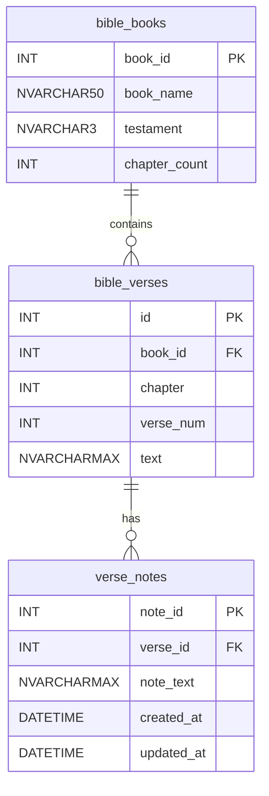

## 3.5 – Table Relationships

- `bible_books` (1) ──◂▸ (many) `bible_verses`: One book contains many verses.
- `bible_verses` (1) ──◂▸ (many) `verse_notes`: One verse can have many user notes.
- Foreign key constraints enforced with CASCADE DELETE on `verse_notes` (deleting a verse removes its notes).

## 3.6 – Data Types Summary

- **INT** — all primary and foreign keys, chapter and verse numbers (exact numeric identifiers).
- **NVARCHAR(n) / NVARCHAR(MAX)** — book names, testament codes, verse text, note text (Unicode strings).
- **DATETIME** — note timestamp (point-in-time value, enables sorting and audit trail).

## 3.7 – SQL Implementation

```sql
CREATE TABLE bible_books (
  book_id INT NOT NULL, book_name VARCHAR(50) NOT NULL,
  testament VARCHAR(3) NOT NULL, chapter_count INT NOT NULL,
  PRIMARY KEY (book_id)
) ENGINE=InnoDB DEFAULT CHARSET=utf8mb4;

CREATE TABLE bible_verses (
  id INT NOT NULL AUTO_INCREMENT, book_id INT NOT NULL,
  chapter INT NOT NULL, verse_num INT NOT NULL, text VARCHAR(800) NOT NULL,
  PRIMARY KEY (id),
  FOREIGN KEY (book_id) REFERENCES bible_books(book_id) ON DELETE CASCADE,
  FULLTEXT KEY ft_verse_text (text)
) ENGINE=InnoDB DEFAULT CHARSET=utf8mb4;

CREATE TABLE verse_notes (
  note_id INT NOT NULL AUTO_INCREMENT, verse_id INT NOT NULL,
  note_text VARCHAR(800) NOT NULL,
  created_at DATETIME NOT NULL DEFAULT CURRENT_TIMESTAMP,
  updated_at DATETIME NOT NULL DEFAULT CURRENT_TIMESTAMP ON UPDATE CURRENT_TIMESTAMP,
  PRIMARY KEY (note_id),
  FOREIGN KEY (verse_id) REFERENCES bible_verses(id) ON DELETE CASCADE
) ENGINE=InnoDB DEFAULT CHARSET=utf8mb4;
```

---

# Part 4 – REST API Design

*Unchanged from Milestone 3. No API modifications were made in Milestone 4.*

The Express.js back-end exposes three resource collections: `/api/verses`, `/api/books`, and `/api/notes`. The API follows REST conventions: plural nouns name resources; URL paths hierarchically refine the resource; HTTP verbs (GET, POST, PUT, DELETE) express intent. The API layer is a façade over service/business-logic classes.

## 4.1 – Books Endpoints

| Method | Endpoint | Operation | Request Body | Response |
|--------|----------|-----------|--------------|----------|
| GET | /api/books | List all 66 books | None | 200 + array of book objects |
| GET | /api/books/:id | Get single book | None | 200 + book object \| 404 |
| GET | /api/books/:id/chapters | Chapter count for book | None | 200 + { bookId, chapterCount } |

## 4.2 – Verses Endpoints

| Method | Endpoint | Operation | Request Body | Response |
|--------|----------|-----------|--------------|----------|
| GET | /api/verses | Search / list all | ?q=keyword&testament=OT\|NT | 200 + array |
| GET | /api/verses?book=:id&chapter=:n | Reference browse | Query params | 200 + array |
| GET | /api/verses/:id | Single verse | None | 200 + verse \| 404 |
| POST | /api/verses | Create verse | { book_id, chapter, verse_num, text } | 201 + verse \| 400 |
| PUT | /api/verses/:id | Update verse | Any subset of verse fields | 200 + verse \| 404 |
| DELETE | /api/verses/:id | Delete verse | None | 204 No Content \| 404 |

## 4.3 – Notes Endpoints

| Method | Endpoint | Operation | Request Body | Response |
|--------|----------|-----------|--------------|----------|
| GET | /api/verses/:id/notes | All notes for verse | None | 200 + array of notes |
| GET | /api/verses/:id/notes/:nid | Single note | None | 200 + note \| 404 |
| POST | /api/verses/:id/notes | Create note | { note_text } | 201 + note \| 400 \| 404 |
| PUT | /api/verses/:id/notes/:nid | Update note | { note_text } | 200 + note \| 404 |
| DELETE | /api/verses/:id/notes/:nid | Delete note | None | 204 No Content \| 404 |

## 4.4 – REST Conventions Applied

- **Plural nouns as resources:** `/verses`, `/books`, `/notes` — never `/getVerse` or `/searchBible`.
- **Hierarchical paths:** `/api/verses/:id/notes` drills from a verse resource into its child notes collection.
- **HTTP verbs carry intent:** GET retrieves, POST creates, PUT updates, DELETE removes — no action verbs in URLs.
- **Query parameters for search/filter:** `?q=keyword&testament=OT` keeps the base resource path clean.
- **Consistent status codes:** 200 OK, 201 Created, 204 No Content, 400 Bad Request, 404 Not Found.

## 4.5 – REST API Testing

All 14 endpoints are implemented and tested in Postman. The Postman collection file (`Bible_Verse_Searcher.postman_collection.json`) is included in the API repository.

Base URL: `http://localhost:3000/api`

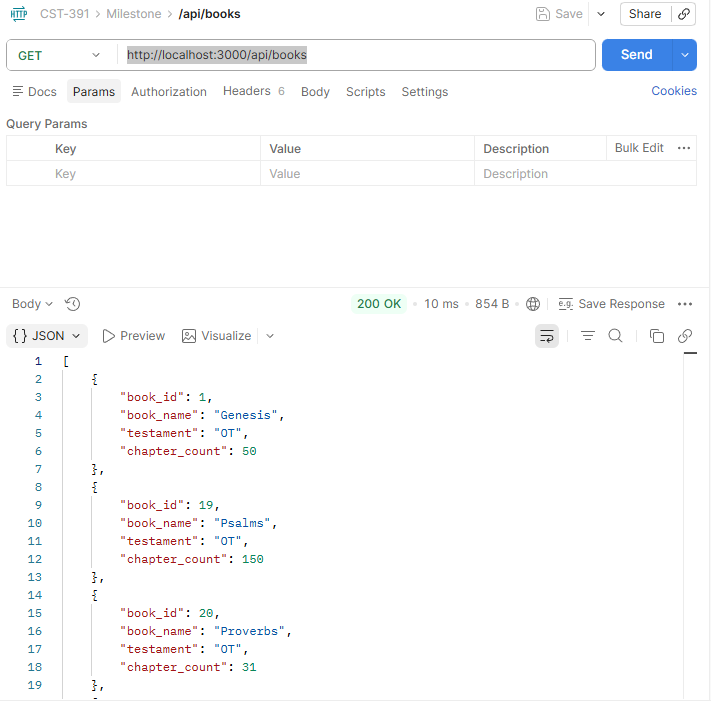

**Figure 1:** Postman successfully accessing `/api/books` — returns all books in the database.

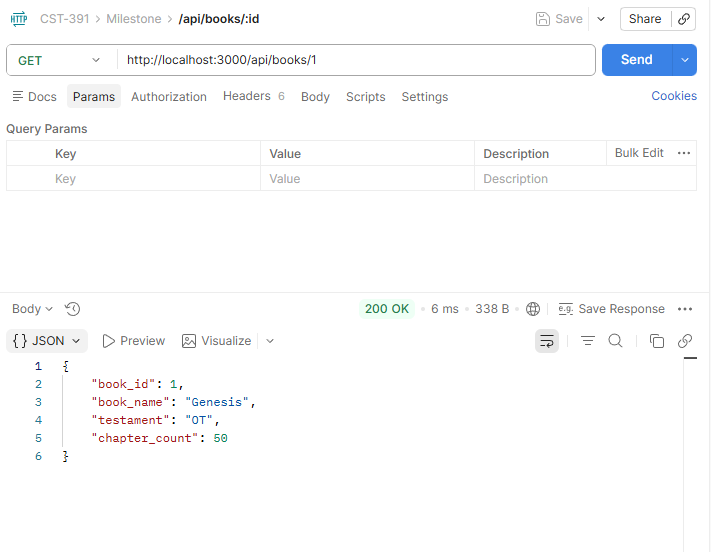

**Figure 2:** Postman successfully accessing `/api/books/:id` — returns a specific book by ID.

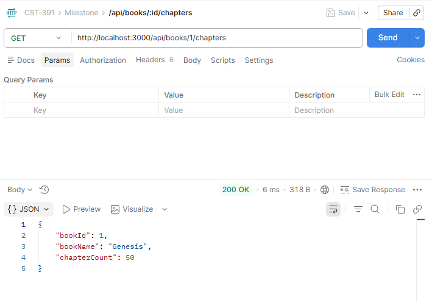

**Figure 3:** Postman successfully accessing `/api/books/:id/chapters` — returns the chapter count for a specific book.

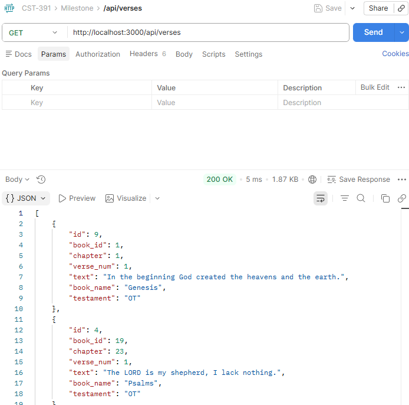

**Figure 4:** Postman successfully accessing `/api/verses` — returns all available verses.

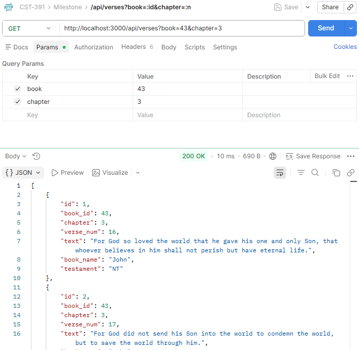

**Figure 5:** Postman successfully accessing `/api/verses?book=:id&chapter=:n` — returns all verses within the given book and chapter.

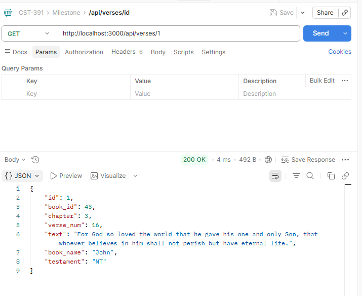

**Figure 6:** Postman successfully accessing `/api/verses/:id` — returns a specific verse by ID.

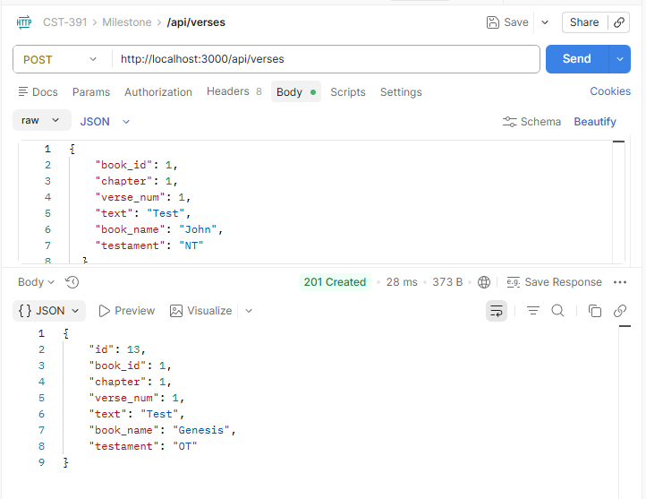

**Figure 7:** Postman successfully accessing `POST /api/verses` — adds a new verse to the database.

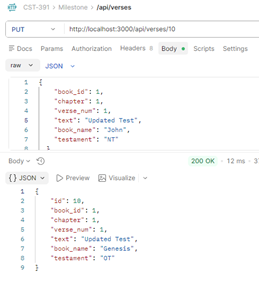

**Figure 8:** Postman successfully accessing `PUT /api/verses/10` — updates the text of the verse just added.

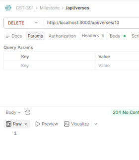

**Figure 9:** Postman successfully accessing `DELETE /api/verses/10` — deletes the verse just added.

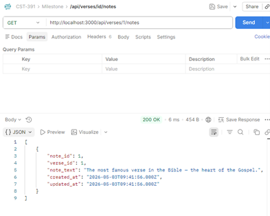

**Figure 10:** Postman successfully accessing `/api/verses/1/notes` — returns all notes for verse 1.

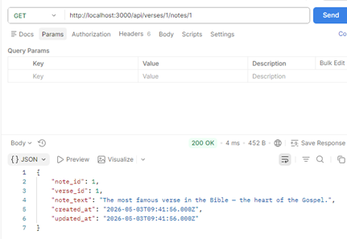

**Figure 11:** Postman successfully accessing `/api/verses/1/notes/1` — returns a specific note by ID.

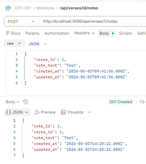

**Figure 12:** Postman successfully accessing `POST /api/verses/1/notes` — creates a new note for verse 1.

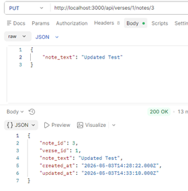

**Figure 13:** Postman successfully accessing `PUT /api/verses/:id/notes/:nid` — updates the text of the note just added.

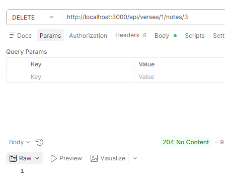

**Figure 14:** Postman successfully accessing `DELETE /api/verses/:id/notes/:nid` — deletes the note just added.

---

# Part 5 – UI Sitemap

## 5.1 – Page Descriptions

The Angular application consists of the following pages:

**Verse List Page**
- Main landing page of the application
- Displays all Bible verses with search and testament filter controls
- Provides navigation to Add Verse, View, Edit, and Delete

**Add Verse Page**
- Form for creating a new Bible verse
- Book dropdown (populated from `/api/books`), chapter, verse number, and text fields
- Validates required fields before submitting to `POST /api/verses`

**Verse Details Page**
- Displays the full verse text and metadata (book, chapter, verse, testament)
- Shows all user-created notes associated with the verse
- Provides inline forms to add, edit, and delete notes

**Edit Verse Page**
- Pre-populated form for updating an existing verse
- Same component as Add Verse, distinguished by the presence of a route `:id` parameter
- Submits to `PUT /api/verses/:id`

## 5.2 – Application Flow Summary

```
Home (/) → Verse List (/verses)
             |
             +--→ Add Verse (/verses/new)          [Create]
             |
             +--→ Verse Details (/verses/:id)       [Read]
             |         |
             |         +--→ Edit Verse (/verses/:id/edit)   [Update]
             |         +--→ Delete Verse (confirm dialog)   [Delete]
             |         +--→ Add / Edit / Delete Notes       [Notes CRUD]
             |
             +--→ Edit Verse (/verses/:id/edit)     [Update — also reachable from list]
```

## 5.3 – Access and Flow Notes

- The Verse List page is the main entry point of the application.
- The Bootstrap NavBar provides links to **Verses** (`/verses`) and **Add Verse** (`/verses/new`) from every page.
- Both Create and Edit use the same `VerseFormComponent`; the route `:id` parameter determines the mode.
- The Verse Details page acts as the hub for note management — all note CRUD operations happen here.

---

# Part 6 – UI Wireframes

## 6.1 – Verse List Page (Read All + Search + Delete)

URL: `/verses` | Method: GET

```
  ✝ Bible Verse Searcher                    [📖 Verses]  [➕ Add Verse]
  ──────────────────────────────────────────────────────────────────────
  [ Search verses...          ]  Testament: [ All      v ]  [🔍 Search] [✕]
  ──────────────────────────────────────────────────────────────────────
  Showing 9 verses

  [ John 3:16  NT ]
  "For God so loved the world that he gave his one and only Son..."
                                          [View]  [Edit]  [Delete]

  [ Psalm 23:1  OT ]
  "The LORD is my shepherd, I lack nothing..."
                                          [View]  [Edit]  [Delete]

  [ Philippians 4:13  NT ]
  "I can do all this through him who gives me strength..."
                                          [View]  [Edit]  [Delete]
```

## 6.2 – Add / Edit Verse Page (Create + Update)

URL: `/verses/new` (Create) | `/verses/:id/edit` (Update)

```
  ✝ Bible Verse Searcher                    [📖 Verses]  [➕ Add Verse]
  ──────────────────────────────────────────────────────────────────────
  ➕ Add New Verse
  ──────────────────────────────────────────────────────────────────────
  Book *          [ John (NT)               v ]
  Chapter *       [ 3    ]     Verse # *   [ 16   ]
  Text *          [                                                    ]
                  [                                                    ]
                  [                                                    ]

                        [Cancel]          [Add Verse]
```

## 6.3 – Verse Details Page (Read One + Notes CRUD)

URL: `/verses/:id`

```
  ✝ Bible Verse Searcher                    [📖 Verses]  [➕ Add Verse]
  ──────────────────────────────────────────────────────────────────────
  ← Back to Verses

  ┌─────────────────────────────────────────────────────┐  [✏️ Edit] [🗑 Delete]
  │  ✝ John 3:16                                        │
  ├─────────────────────────────────────────────────────┤
  │  "For God so loved the world that he gave his       │
  │   one and only Son, that whoever believes in him    │
  │   shall not perish but have eternal life."          │
  │                         — John 3:16  [ NT ]         │
  └─────────────────────────────────────────────────────┘

  📝 Personal Notes (1)
  ──────────────────────────────────────────────────────────────────────
  The most famous verse in the Bible — the heart of the Gospel.
  Apr 27, 2026                                    [Edit]  [Delete]

  ── Add a Note ────────────────────────────────────────
  [ Write your personal reflection or study note...    ]
  [ 💾 Save Note ]
```

## 6.4 – Edit Note (Inline on Details Page)

Activated by clicking [Edit] on a saved note:

```
  ── Editing Note ──────────────────────────────────────
  [ The most famous verse — captures the entire Gospel  ]

  [Cancel]      [Save]
```

---

# Part 7 – UML Classes

*The back-end service and model classes are unchanged from Milestone 3. The Angular front-end adds a service layer and component layer on the client side.*

## 7.1 – Model Layer (back-end, unchanged)

| Class | Property / Method | Type / Return | Description |
|-------|-------------------|---------------|-------------|
| BibleVerse | Id | int | Primary key |
| BibleVerse | BookId | int | Foreign key to BibleBook |
| BibleVerse | Chapter | int | Chapter number |
| BibleVerse | VerseNum | int | Verse number within chapter |
| BibleVerse | Text | string | Verse text content |
| BibleBook | BookId | int | Primary key |
| BibleBook | BookName | string | Full book name (e.g. Genesis) |
| BibleBook | Testament | string | OT or NT |
| BibleBook | ChapterCount | int | Total chapters in the book |
| VerseNote | NoteId | int | Primary key |
| VerseNote | VerseId | int | FK to BibleVerse |
| VerseNote | NoteText | string | User comment text |
| VerseNote | CreatedAt | DateTime | Timestamp of creation |
| VerseNote | UpdatedAt | DateTime | Timestamp of last update |
| SearchViewModel | SearchTerm | string | User search input |
| SearchViewModel | OldTestament | bool | Include OT in results flag |
| SearchViewModel | NewTestament | bool | Include NT in results flag |
| SearchViewModel | Results | List\<BibleVerse\> | Populated search result list |

## 7.2 – Data Access Layer (DAO Pattern, unchanged)

| Class / Interface | Method | Description |
|-------------------|--------|-------------|
| IBibleVerseDAO | GetVerseById(id) | Returns single verse by ID |
| IBibleVerseDAO | SearchVerses(term, ot, nt) | Full-text search with filters |
| IBibleVerseDAO | GetVersesByChapter(bookId, ch) | All verses in a chapter |
| IBibleBookDAO | GetAllBooks() | Returns all 66 books |
| IBibleBookDAO | GetChapterCount(bookId) | Chapter count for a book |
| IVerseNoteDAO | GetNotesByVerseId(verseId) | Fetch notes for a verse |
| IVerseNoteDAO | AddNote(note) | Insert new note |
| IVerseNoteDAO | UpdateNote(noteId, text) | Update note text |
| IVerseNoteDAO | DeleteNote(noteId) | Delete a note |
| SqlBibleVerseDAO | SearchVerses(...) | Implements IBibleVerseDAO via SQL |
| SqlBibleBookDAO | GetAllBooks() | Implements IBibleBookDAO via SQL |
| SqlVerseNoteDAO | AddNote(note) | Implements IVerseNoteDAO via SQL |

## 7.3 – Service Layer (back-end, unchanged)

| Class | Method | Description |
|-------|--------|-------------|
| VerseService | searchVerses(term, ot, nt) | Full-text search with testament filters; delegates to DAO |
| VerseService | getVerseById(id) | Retrieve a single verse by primary key |
| VerseService | getVersesByChapter(bookId, ch) | All verses in a specific book/chapter |
| BookService | getAllBooks() | Returns the full list of 66 Bible books |
| BookService | getChapterCount(bookId) | Returns chapter count for a given book |
| NoteService | getNotesByVerseId(verseId) | Retrieve all notes for a verse |
| NoteService | addNote(note) | Insert a new note tied to a verse |
| NoteService | updateNote(noteId, text) | Update the text of an existing note |
| NoteService | deleteNote(noteId) | Permanently delete a note |

## 7.4 – Angular Client Layer (new — Milestone 4)

### Components

| Component | Route | Responsibility | CRUD Operation |
|-----------|-------|---------------|----------------|
| NavbarComponent | (global) | Bootstrap NavBar with RouterLink / RouterLinkActive | Navigation |
| VerseListComponent | /verses | Search, filter by testament, browse all, delete | Read (all) + Delete |
| VerseFormComponent | /verses/new | Form to create a new verse | Create |
| VerseFormComponent | /verses/:id/edit | Pre-populated form to update a verse | Update |
| VerseDetailComponent | /verses/:id | Full verse text + Notes CRUD (add/edit/delete) | Read (one) + Notes CRUD |

### VerseService (Angular client)

| Method | Maps to REST Endpoint | Purpose |
|--------|-----------------------|---------|
| getBooks() | GET /api/books | Populate book dropdown in VerseFormComponent |
| searchVerses(q, testament) | GET /api/verses?q=&testament= | Search + filter on VerseListComponent |
| getVersesByReference(bookId, ch) | GET /api/verses?book=&chapter= | Reference browse |
| getVerseById(id) | GET /api/verses/:id | Load single verse in VerseDetail + VerseForm (edit) |
| createVerse(dto) | POST /api/verses | Save new verse from VerseFormComponent |
| updateVerse(id, dto) | PUT /api/verses/:id | Save edits from VerseFormComponent |
| deleteVerse(id) | DELETE /api/verses/:id | Delete from VerseList or VerseDetail |
| getNotes(verseId) | GET /api/verses/:id/notes | Load notes in VerseDetailComponent |
| createNote(verseId, dto) | POST /api/verses/:id/notes | Add note in VerseDetailComponent |
| updateNote(verseId, noteId, dto) | PUT /api/verses/:id/notes/:nid | Inline edit note |
| deleteNote(verseId, noteId) | DELETE /api/verses/:id/notes/:nid | Remove note |

### Angular Routes

| Path | Component | Description |
|------|-----------|-------------|
| / | (redirect) | Redirects to /verses |
| /verses | VerseListComponent | Read all + search + delete |
| /verses/new | VerseFormComponent | Create |
| /verses/:id | VerseDetailComponent | Read one + notes CRUD |
| /verses/:id/edit | VerseFormComponent | Update (pre-populated) |

---

# Part 8 – Risks

| Risk | Likelihood | Impact | Mitigation |
|------|-----------|--------|------------|
| Database performance on 31,000+ verse dataset (slow queries, missing indexes) | Medium | High | Add full-text indexes on `bible_verses.text`; test queries with EXPLAIN before M5. |
| Full-text search accuracy (partial match, case sensitivity issues) | Medium | High | Use SQL LIKE with LOWER(); evaluate full-text search index for production. |
| Scalability — no authentication or multi-user support yet | Low | Medium | Deferred to post-MVP; API is stateless and can be extended with JWT auth later. |
| Data integrity — orphaned notes if verse records are deleted | Low | High | CASCADE DELETE on `verse_notes` FK enforced at DB level. |
| UI consistency between Angular and React implementations | Medium | Medium | Both UIs consume the identical REST API; shared integration test suite. |
| React learning curve slowing M5 development | High | Medium | Complete React activity assignments first; reuse same service patterns from Angular. |
| CORS misconfiguration blocking front-end API calls | Medium | High | `cors()` middleware applied globally in Express; validated in M3 before Angular work began. |
| Scope creep beyond High-priority user stories | Medium | Medium | Lock MVP to US-01 through US-09; Medium/Low stories deferred unless time permits. |

---

# Part 9 – Design Updates & Known Issues

The table below summarizes all changes from Milestone 3 to Milestone 4. Items marked **TO DO** are known gaps planned for Milestone 5 (React).

| # | Area | M3 State | M4 Implementation | Status |
|---|------|----------|-------------------|--------|
| 1 | Angular application | Not yet built | Full Angular 17 SPA with lazy-loaded routing | Complete |
| 2 | Bootstrap NavBar | Wireframe only | NavbarComponent with RouterLink + RouterLinkActive active state | Complete |
| 3 | Verse List — Read all | Wireframe only | VerseListComponent with keyword search + testament filter | Complete |
| 4 | Add Verse — Create | Wireframe only | VerseFormComponent with book dropdown, validation, POST to API | Complete |
| 5 | View Verse — Read one | Wireframe only | VerseDetailComponent with full text, badges, and metadata | Complete |
| 6 | Edit Verse — Update | Wireframe only | Shared VerseFormComponent pre-populated via route `:id` | Complete |
| 7 | Delete Verse | Wireframe only | Confirm dialog; list updates reactively after DELETE | Complete |
| 8 | Notes CRUD | Wireframe only | Add / inline-edit / delete notes on VerseDetailComponent | Complete |
| 9 | Angular routing | Designed | Lazy-loaded routes: `/verses`, `/verses/new`, `/verses/:id`, `/verses/:id/edit` | Complete |
| 10 | HTTP integration | Assumed | VerseService using HttpClient; all 14 REST endpoints consumed | Complete |
| 11 | Pagination | TO DO from M3 | Still not implemented — client renders all results | TO DO — M5 |
| 12 | Input validation | TO DO from M3 | Required-field presence checks only; no Angular reactive form validators | TO DO — M5 |
| 13 | FULLTEXT search at runtime | TO DO from M3 | Schema has FULLTEXT KEY; API still uses LIKE at runtime | TO DO — M5 |
| 14 | Authentication / security | Out of scope | Still anonymous; no auth planned until post-MVP | Per spec |
| 15 | Unit tests | Not specified | No Jasmine/Karma tests written | TO DO — M6 |

---

## Angular Application Screenshots

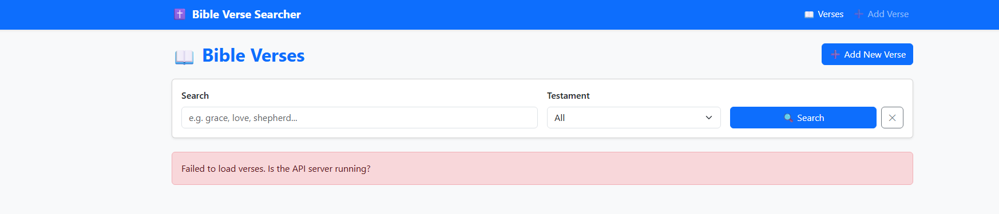

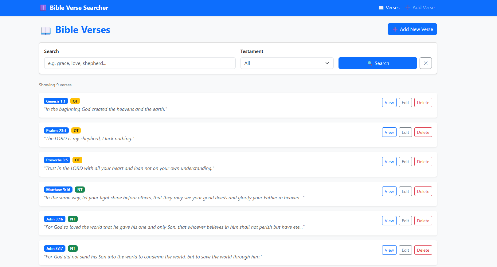

**Figures 15 and 16:** The Angular Verse List page before and after starting the bible-api, showing none, and then all verses with search bar, testament filter, and View / Edit / Delete controls.

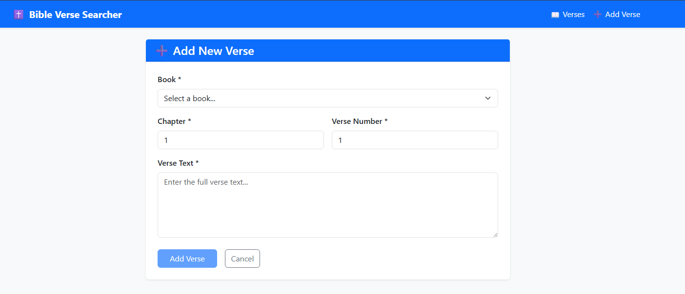

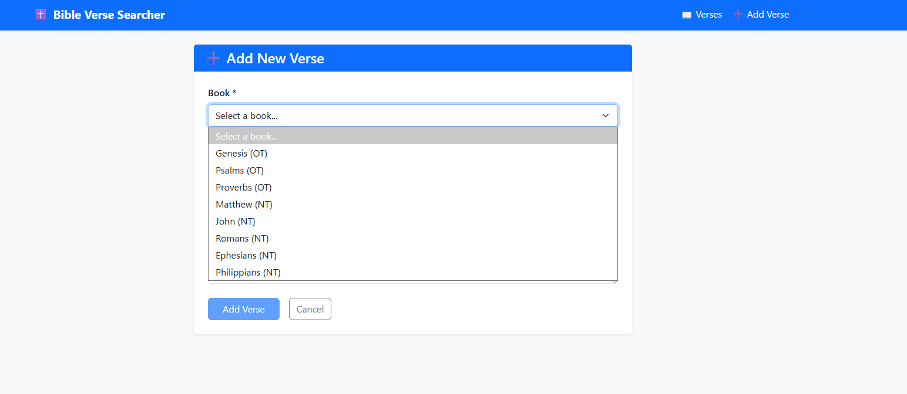

**Figures 17 and 18:** The Add Verse form showing the book dropdown (populated from `/api/books`), chapter, verse number, and text fields.

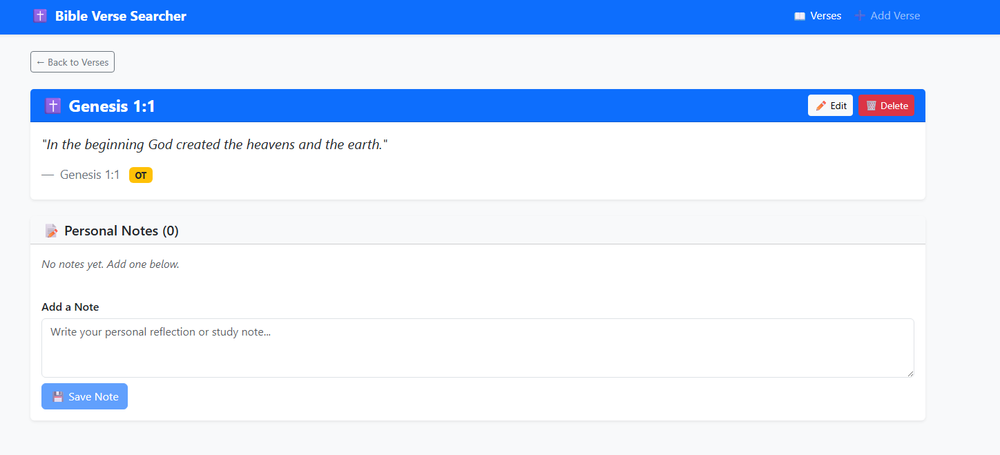

**Figure 19:** The Verse Details page showing full verse text, metadata badges, and the Notes section with add/edit/delete controls.

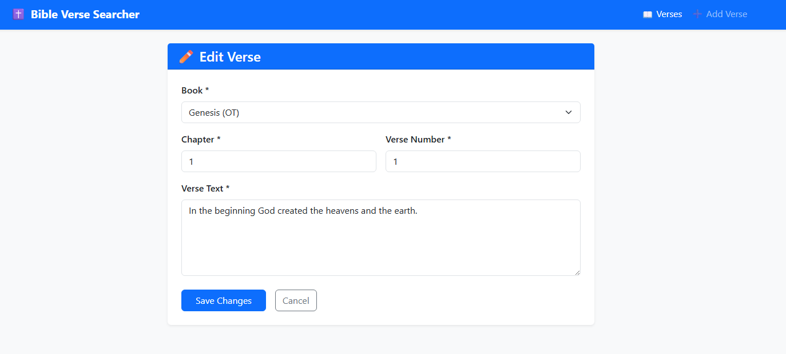

**Figure 20:** The Edit Verse form pre-populated with existing verse data. It uses the same VerseFormComponent used for Create, driven by the route `:id` parameter.