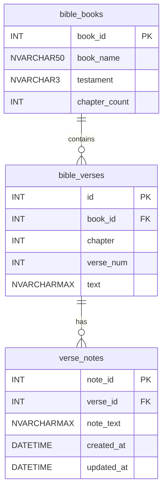
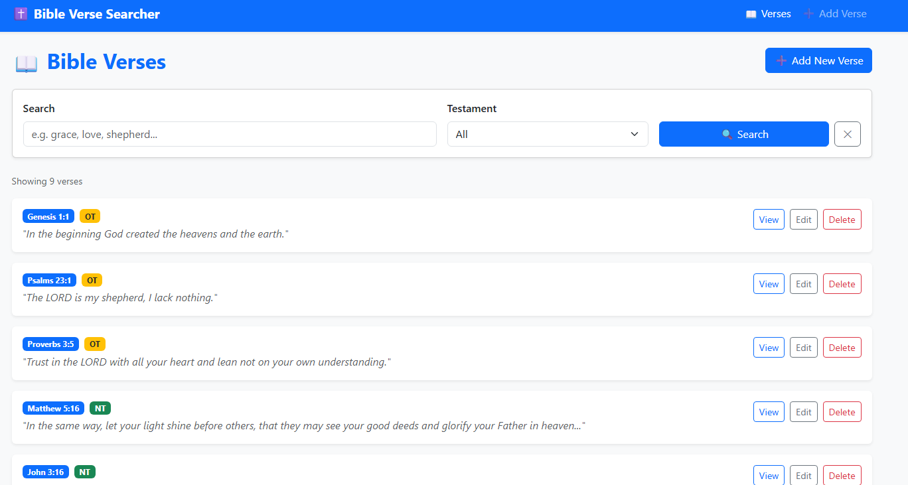
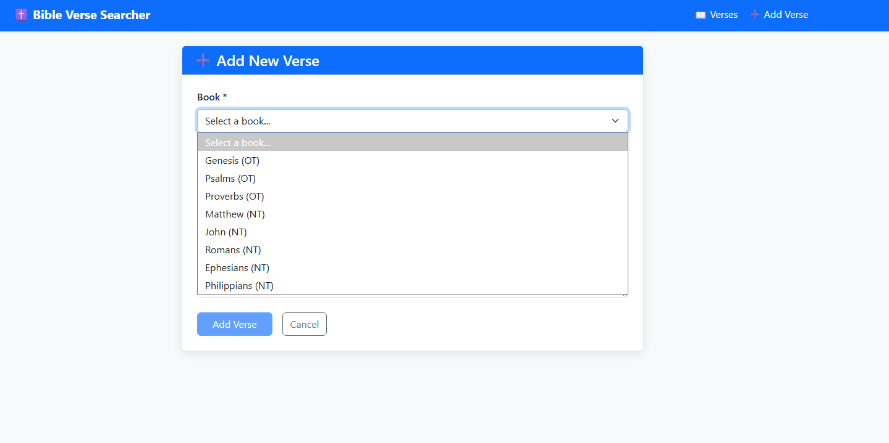
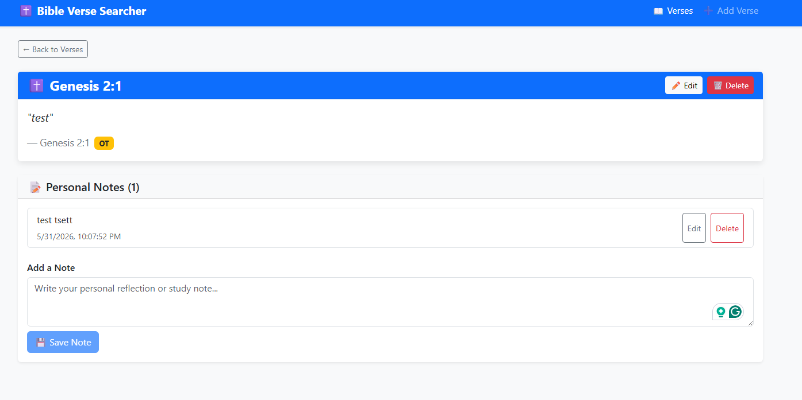
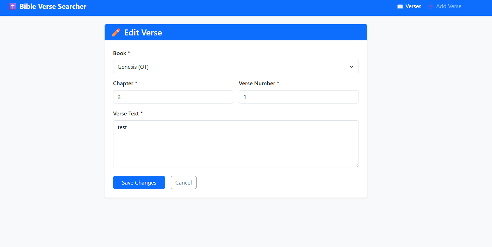

# 👁️‍🗨️ CST-391: JavaScript Web Application Development

- Milestone Project: Bible Verse Searcher
- Author: **Victor Manuel Marrujo Verdugo**
- College of Humanities and Social Sciences, Grand Canyon University
- Professor Bobby Estey
- May 24th, 2026

## Screencast Links

- [Video Part 1 — Power Point Walkthrough]( https://www.loom.com/share/895cfd903f1940b89980b398b58f1418)
- [Video Part 2 — UI Navigation & Effects](https://www.loom.com/share/9dab6d463e1441e9b6d828cff23f2332)

---

# Instructor Feedback

## Milestone 4 Instructor Feedback

> *WOW!!!!!!!!!!!!!!!!!!!!!!! - OH WOW!!!!!!!!!!!!!!!!!!!! - AMAZING. Your the Markdown / MermaidJS Master - I TOLD YOU SO. Now Spread the Word :-)
> Victor, I am SO PROUD OF YOU.  This was DETAILED, TECHNICAL, PROFESSIONAL.  Well Done BROTHER, Bobby :-)*

## Response to Feedback

Milestone 4 received full marks and no corrective changes were required. The following improvements were applied in Milestone 5 building on that foundation:

- Maintained the same professional document structure, cover page, and writing style noted by the instructor.
- REST API documentation carried forward unchanged — no API modifications were needed for M5.
- React front-end built to the same standards: typed models, a centralized service layer, and clean route definitions.
- Design updates table updated to reflect all M5 additions and known issues remaining for M6.*

---

# Part 1 – Introduction

The Bible Verse Searcher is a web-based application designed to help users search, explore, and annotate Bible verses. The system allows users to perform keyword searches, browse scripture by book and chapter, and attach personal notes to verses.

The application follows an N-Layer architecture using a Node.js/Express.js back-end REST API and a MySQL relational database, with two independent front-end implementations built in Angular and React. Concerns are cleanly separated between presentation, business logic (service layer), and data access layers.

This project aligns with a Christian worldview by providing a tool for Bible study, reflection, and spiritual growth. Users such as pastors, students, and individuals can efficiently navigate scripture and store personal insights.

**Milestone 5** delivers the React front-end. The React application consumes the same 14 REST API endpoints built in Milestone 3, implements full CRUD for Bible verses and notes, and provides a Bootstrap 5 NavBar for navigation. The React implementation mirrors all features from the Angular app but uses React 18, React Router v6, Vite, and Axios instead of Angular's framework primitives.

---

# Part 2 – Functionality Requirements (User Stories)

The following user stories define the full scope of the Bible Verse Searcher. Stories are prioritized as High (MVP), Medium (desired), or Low (stretch).

| ID    | User Story | Priority | Notes |
|-------|-----------|----------|-------|
| US-01 | As a user, I want to search for Bible verses by keyword so that I can quickly find relevant scripture. | High | Search bar on Verse List page |
| US-02 | As a user, I want to filter search results by Old or New Testament so that I can narrow my search. | High | Testament dropdown on Verse List page |
| US-03 | As a user, I want to view all verses in a selected book and chapter so that I can read scripture in context. | High | Reference browse via query params |
| US-04 | As a user, I want to view detailed information about a specific verse so that I can study it more deeply. | High | Verse Details page |
| US-05 | As a user, I want to add a note to a verse so that I can record personal insights or reflections. | High | Add Note form on Details page |
| US-06 | As a user, I want to view all previously added notes on a verse so that I can revisit my thoughts. | High | Saved Notes section on Details page |
| US-07 | As a user, I want to edit an existing note so that I can correct or update my reflections. | Medium | Inline edit on Details page |
| US-08 | As a user, I want to delete a note so that I can remove entries I no longer find useful. | Medium | Delete button with confirmation |
| US-09 | As a user, I want the system to store and retrieve data reliably so that my notes are never lost. | High | MySQL persistence via REST API |
| US-10 | As a user, I want to see results sorted by relevance or book order so that I can find the best match quickly. | Medium | Sort control on Results page |

---

# Part 3 – Database Design

*Unchanged from Milestone 3. No schema changes were made in Milestones 4 or 5.*

## 3.1 – bible_books table

| Column | Data Type | Constraints |
|--------|-----------|-------------|
| book_id | INT | PK, NOT NULL |
| book_name | NVARCHAR(50) | NOT NULL |
| testament | NVARCHAR(3) | OT / NT |
| chapter_count | INT | NOT NULL |

## 3.2 – bible_verses table

| Column | Data Type | Constraints |
|--------|-----------|-------------|
| id | INT | PK, IDENTITY |
| book_id | INT | FK → bible_books |
| chapter | INT | NOT NULL |
| verse_num | INT | NOT NULL |
| text | NVARCHAR(MAX) | NOT NULL |

## 3.3 – verse_notes table

| Column | Data Type | Constraints |
|--------|-----------|-------------|
| note_id | INT | PK, IDENTITY |
| verse_id | INT | FK → bible_verses |
| note_text | NVARCHAR(MAX) | NOT NULL |
| created_at | DATETIME | DEFAULT CURRENT_TIMESTAMP |
| updated_at | DATETIME | DEFAULT CURRENT_TIMESTAMP ON UPDATE |

## 3.4 – ER Diagram



## 3.5 – Table Relationships

- `bible_books` (1) ──◂▸ (many) `bible_verses`: One book contains many verses.
- `bible_verses` (1) ──◂▸ (many) `verse_notes`: One verse can have many user notes.
- Foreign key constraints enforced with CASCADE DELETE on `verse_notes` (deleting a verse removes its notes).

## 3.6 – Data Types Summary

- **INT** — all primary and foreign keys, chapter and verse numbers.
- **NVARCHAR(n) / NVARCHAR(MAX)** — book names, testament codes, verse text, note text (Unicode strings).
- **DATETIME** — note timestamp (point-in-time value, enables sorting and audit trail).

## 3.7 – SQL Implementation

```sql
CREATE TABLE bible_books (
  book_id INT NOT NULL, book_name VARCHAR(50) NOT NULL,
  testament VARCHAR(3) NOT NULL, chapter_count INT NOT NULL,
  PRIMARY KEY (book_id)
) ENGINE=InnoDB DEFAULT CHARSET=utf8mb4;

CREATE TABLE bible_verses (
  id INT NOT NULL AUTO_INCREMENT, book_id INT NOT NULL,
  chapter INT NOT NULL, verse_num INT NOT NULL, text VARCHAR(800) NOT NULL,
  PRIMARY KEY (id),
  FOREIGN KEY (book_id) REFERENCES bible_books(book_id) ON DELETE CASCADE,
  FULLTEXT KEY ft_verse_text (text)
) ENGINE=InnoDB DEFAULT CHARSET=utf8mb4;

CREATE TABLE verse_notes (
  note_id INT NOT NULL AUTO_INCREMENT, verse_id INT NOT NULL,
  note_text VARCHAR(800) NOT NULL,
  created_at DATETIME NOT NULL DEFAULT CURRENT_TIMESTAMP,
  updated_at DATETIME NOT NULL DEFAULT CURRENT_TIMESTAMP ON UPDATE CURRENT_TIMESTAMP,
  PRIMARY KEY (note_id),
  FOREIGN KEY (verse_id) REFERENCES bible_verses(id) ON DELETE CASCADE
) ENGINE=InnoDB DEFAULT CHARSET=utf8mb4;
```

---

# Part 4 – REST API Design

*Unchanged from Milestone 3. No API modifications were made in Milestones 4 or 5.*

## 4.1 – Books Endpoints

| Method | Endpoint | Operation | Request Body | Response |
|--------|----------|-----------|--------------|----------|
| GET | /api/books | List all 66 books | None | 200 + array of book objects |
| GET | /api/books/:id | Get single book | None | 200 + book object \| 404 |
| GET | /api/books/:id/chapters | Chapter count for book | None | 200 + { bookId, chapterCount } |

## 4.2 – Verses Endpoints

| Method | Endpoint | Operation | Request Body | Response |
|--------|----------|-----------|--------------|----------|
| GET | /api/verses | Search / list all | ?q=keyword&testament=OT\|NT | 200 + array |
| GET | /api/verses?book=:id&chapter=:n | Reference browse | Query params | 200 + array |
| GET | /api/verses/:id | Single verse | None | 200 + verse \| 404 |
| POST | /api/verses | Create verse | { book_id, chapter, verse_num, text } | 201 + verse \| 400 |
| PUT | /api/verses/:id | Update verse | Any subset of verse fields | 200 + verse \| 404 |
| DELETE | /api/verses/:id | Delete verse | None | 204 No Content \| 404 |

## 4.3 – Notes Endpoints

| Method | Endpoint | Operation | Request Body | Response |
|--------|----------|-----------|--------------|----------|
| GET | /api/verses/:id/notes | All notes for verse | None | 200 + array of notes |
| GET | /api/verses/:id/notes/:nid | Single note | None | 200 + note \| 404 |
| POST | /api/verses/:id/notes | Create note | { note_text } | 201 + note \| 400 \| 404 |
| PUT | /api/verses/:id/notes/:nid | Update note | { note_text } | 200 + note \| 404 |
| DELETE | /api/verses/:id/notes/:nid | Delete note | None | 204 No Content \| 404 |

## 4.4 – REST Conventions Applied

- **Plural nouns as resources:** `/verses`, `/books`, `/notes` — never `/getVerse` or `/searchBible`.
- **Hierarchical paths:** `/api/verses/:id/notes` drills from a verse into its child notes collection.
- **HTTP verbs carry intent:** GET retrieves, POST creates, PUT updates, DELETE removes.
- **Query parameters for search/filter:** `?q=keyword&testament=OT` keeps the base resource path clean.
- **Consistent status codes:** 200 OK, 201 Created, 204 No Content, 400 Bad Request, 404 Not Found.

---

# Part 5 – UI Sitemap

## 5.1 – Page Descriptions

**Verse List Page**
- Main landing page of the application
- Displays all Bible verses with keyword search and testament filter
- Provides navigation to Add Verse, View, Edit, and Delete for each result

**Add Verse Page**
- Form for creating a new Bible verse
- Book dropdown populated from `/api/books`, chapter, verse number, and text fields
- Validates required fields before submitting to `POST /api/verses`

**Verse Details Page**
- Displays the full verse text and metadata (book, chapter, verse, testament badge)
- Shows all user-created notes with timestamps
- Inline forms to add, edit, and delete notes

**Edit Verse Page**
- Pre-populated form for updating an existing verse
- Same `VerseForm` component as Add Verse, driven by the presence of the route `:id` param
- Submits to `PUT /api/verses/:id`

## 5.2 – Application Flow Summary

```
Home (/) → Verse List (/verses)
             |
             +--→ Add Verse (/verses/new)             [Create]
             |
             +--→ Verse Details (/verses/:id)          [Read]
             |         |
             |         +--→ Edit Verse (/verses/:id/edit)   [Update]
             |         +--→ Delete Verse (confirm dialog)   [Delete]
             |         +--→ Add / Edit / Delete Notes       [Notes CRUD]
             |
             +--→ Edit Verse (/verses/:id/edit)        [also reachable from list]
```

## 5.3 – Access and Flow Notes

- The Verse List page is the main entry point of the application.
- The Bootstrap NavBar provides **Verses** and **Add Verse** links from every page using React Router `NavLink` for active state highlighting.
- Both Create and Edit share the same `VerseForm` component; the route `:id` parameter determines the mode.
- The Verse Details page is the hub for note management — all note CRUD operations happen here without page navigation.

---

# Part 6 – UI Wireframes

## 6.1 – Verse List Page (Read All + Search + Delete)

URL: `/verses`

```
  ✝ Bible Verse Searcher                    [📖 Verses]  [➕ Add Verse]
  ──────────────────────────────────────────────────────────────────────
  [ Search verses...          ]  Testament: [ All      v ]  [🔍 Search] [✕]
  ──────────────────────────────────────────────────────────────────────
  Showing 9 verses

  [ John 3:16  NT ]
  "For God so loved the world that he gave his one and only Son..."
                                          [View]  [Edit]  [Delete]

  [ Psalm 23:1  OT ]
  "The LORD is my shepherd, I lack nothing..."
                                          [View]  [Edit]  [Delete]

  [ Philippians 4:13  NT ]
  "I can do all this through him who gives me strength..."
                                          [View]  [Edit]  [Delete]
```

## 6.2 – Add / Edit Verse Page (Create + Update)

URL: `/verses/new` (Create) | `/verses/:id/edit` (Update)

```
  ✝ Bible Verse Searcher                    [📖 Verses]  [➕ Add Verse]
  ──────────────────────────────────────────────────────────────────────
  ➕ Add New Verse
  ──────────────────────────────────────────────────────────────────────
  Book *          [ John (NT)               v ]
  Chapter *       [ 3    ]     Verse # *   [ 16   ]
  Text *          [                                                    ]
                  [                                                    ]

                        [Cancel]          [Add Verse]
```

## 6.3 – Verse Details Page (Read One + Notes CRUD)

URL: `/verses/:id`

```
  ✝ Bible Verse Searcher                    [📖 Verses]  [➕ Add Verse]
  ──────────────────────────────────────────────────────────────────────
  ← Back to Verses

  ┌─────────────────────────────────────────────────┐  [✏️ Edit] [🗑 Delete]
  │  ✝ John 3:16                                    │
  ├─────────────────────────────────────────────────┤
  │  "For God so loved the world that he gave his   │
  │   one and only Son..."                          │
  │                       — John 3:16  [ NT ]       │
  └─────────────────────────────────────────────────┘

  📝 Personal Notes (1)
  ──────────────────────────────────────────────────
  The most famous verse in the Bible.
  Apr 27, 2026                          [Edit]  [Delete]

  ── Add a Note ────────────────────────────────────
  [ Write your personal reflection...              ]
  [ 💾 Save Note ]
```

## 6.4 – Edit Note (Inline on Details Page)

Activated by clicking [Edit] on a saved note:

```
  ── Editing Note ──────────────────────────────────
  [ The most famous verse — captures the Gospel    ]

  [Cancel]      [Save]
```

---

# Part 7 – UML Classes

## 7.1 – Model Layer (back-end, unchanged)

| Class | Property / Method | Type / Return | Description |
|-------|-------------------|---------------|-------------|
| BibleVerse | Id | int | Primary key |
| BibleVerse | BookId | int | Foreign key to BibleBook |
| BibleVerse | Chapter | int | Chapter number |
| BibleVerse | VerseNum | int | Verse number within chapter |
| BibleVerse | Text | string | Verse text content |
| BibleBook | BookId | int | Primary key |
| BibleBook | BookName | string | Full book name |
| BibleBook | Testament | string | OT or NT |
| BibleBook | ChapterCount | int | Total chapters in the book |
| VerseNote | NoteId | int | Primary key |
| VerseNote | VerseId | int | FK to BibleVerse |
| VerseNote | NoteText | string | User comment text |
| VerseNote | CreatedAt | DateTime | Timestamp of creation |
| VerseNote | UpdatedAt | DateTime | Timestamp of last update |
| SearchViewModel | SearchTerm | string | User search input |
| SearchViewModel | OldTestament | bool | Include OT in results flag |
| SearchViewModel | NewTestament | bool | Include NT in results flag |
| SearchViewModel | Results | List\<BibleVerse\> | Populated search result list |

## 7.2 – Data Access Layer (DAO Pattern, unchanged)

| Class / Interface | Method | Description |
|-------------------|--------|-------------|
| IBibleVerseDAO | GetVerseById(id) | Returns single verse by ID |
| IBibleVerseDAO | SearchVerses(term, ot, nt) | Full-text search with filters |
| IBibleVerseDAO | GetVersesByChapter(bookId, ch) | All verses in a chapter |
| IBibleBookDAO | GetAllBooks() | Returns all 66 books |
| IBibleBookDAO | GetChapterCount(bookId) | Chapter count for a book |
| IVerseNoteDAO | GetNotesByVerseId(verseId) | Fetch notes for a verse |
| IVerseNoteDAO | AddNote(note) | Insert new note |
| IVerseNoteDAO | UpdateNote(noteId, text) | Update note text |
| IVerseNoteDAO | DeleteNote(noteId) | Delete a note |
| SqlBibleVerseDAO | SearchVerses(...) | Implements IBibleVerseDAO via SQL |
| SqlBibleBookDAO | GetAllBooks() | Implements IBibleBookDAO via SQL |
| SqlVerseNoteDAO | AddNote(note) | Implements IVerseNoteDAO via SQL |

## 7.3 – Service Layer (back-end, unchanged)

| Class | Method | Description |
|-------|--------|-------------|
| VerseService | searchVerses(term, ot, nt) | Full-text search with testament filters |
| VerseService | getVerseById(id) | Retrieve a single verse by primary key |
| VerseService | getVersesByChapter(bookId, ch) | All verses in a specific book/chapter |
| BookService | getAllBooks() | Returns the full list of 66 Bible books |
| BookService | getChapterCount(bookId) | Returns chapter count for a given book |
| NoteService | getNotesByVerseId(verseId) | Retrieve all notes for a verse |
| NoteService | addNote(note) | Insert a new note tied to a verse |
| NoteService | updateNote(noteId, text) | Update the text of an existing note |
| NoteService | deleteNote(noteId) | Permanently delete a note |

## 7.4 – React Client Layer (new — Milestone 5)

### Components

| Component | Route | Responsibility | CRUD Operation |
|-----------|-------|---------------|----------------|
| Navbar | (global) | Bootstrap NavBar with NavLink active state | Navigation |
| VerseList | /verses | Search, filter by testament, browse all, delete | Read (all) + Delete |
| VerseForm | /verses/new | Form to create a new verse | Create |
| VerseForm | /verses/:id/edit | Pre-populated form to update a verse | Update |
| VerseDetail | /verses/:id | Full verse text + Notes CRUD | Read (one) + Notes CRUD |

### verseService (React client — Axios)

| Function | Maps to REST Endpoint | Purpose |
|----------|-----------------------|---------|
| getBooks() | GET /api/books | Populate book dropdown in VerseForm |
| searchVerses(q, testament) | GET /api/verses?q=&testament= | Search + filter on VerseList |
| getVerseById(id) | GET /api/verses/:id | Load single verse in VerseDetail + VerseForm |
| createVerse(dto) | POST /api/verses | Save new verse from VerseForm |
| updateVerse(id, dto) | PUT /api/verses/:id | Save edits from VerseForm |
| deleteVerse(id) | DELETE /api/verses/:id | Delete from VerseList or VerseDetail |
| getNotes(verseId) | GET /api/verses/:id/notes | Load notes in VerseDetail |
| createNote(verseId, text) | POST /api/verses/:id/notes | Add note in VerseDetail |
| updateNote(verseId, noteId, text) | PUT /api/verses/:id/notes/:nid | Inline edit note |
| deleteNote(verseId, noteId) | DELETE /api/verses/:id/notes/:nid | Remove note |

### React Routes

| Path | Component | Description |
|------|-----------|-------------|
| / | (redirect) | Redirects to /verses |
| /verses | VerseList | Read all + search + delete |
| /verses/new | VerseForm | Create |
| /verses/:id | VerseDetail | Read one + notes CRUD |
| /verses/:id/edit | VerseForm | Update (pre-populated) |

### Angular vs React Comparison

| Concern | Angular (M4) | React (M5) |
|---------|-------------|------------|
| Language | TypeScript | TypeScript |
| Routing | @angular/router (lazy loadComponent) | React Router v6 (BrowserRouter + Routes) |
| HTTP | HttpClient (provideHttpClient) | Axios |
| State | Component properties + ngOnInit | useState + useEffect hooks |
| Templates | HTML templates with directives (*ngFor, *ngIf) | JSX with inline expressions |
| Styles | Bootstrap 5 via CDN | Bootstrap 5 via CDN + npm |
| Build tool | Angular CLI (webpack) | Vite |
| Dev port | 4200 | 5173 |

---

# Part 8 – Risks

| Risk | Likelihood | Impact | Mitigation |
|------|-----------|--------|------------|
| Database performance on 31,000+ verse dataset | Medium | High | Full-text indexes on `bible_verses.text`; LIKE search used for compatibility. |
| Full-text search accuracy (partial match, case sensitivity) | Medium | High | LOWER() + LIKE in API; FULLTEXT MATCH AGAINST planned as future improvement. |
| Scalability — no authentication or multi-user support | Low | Medium | Deferred; API is stateless and can be extended with JWT auth post-MVP. |
| Data integrity — orphaned notes on verse delete | Low | High | CASCADE DELETE on `verse_notes` FK enforced at DB level. |
| UI consistency between Angular and React | Low | Medium | Both UIs consume the identical REST API; feature parity confirmed in M5. |
| CORS misconfiguration | Low | High | `cors()` middleware validated in M3; no issues encountered in M4 or M5. |
| Scope creep beyond High-priority user stories | Low | Medium | MVP locked to US-01–US-09; Medium stories deferred. |

---

# Part 9 – Design Updates & Known Issues

The table below summarizes all changes from Milestone 4 to Milestone 5. Items marked **TO DO** are planned for Milestone 6.

| # | Area | M4 State | M5 Implementation | Status |
|---|------|----------|-------------------|--------|
| 1 | React application | Not yet built | Full React 18 SPA with React Router v6 | Complete |
| 2 | Bootstrap NavBar | Angular RouterLinkActive | React Router NavLink with active state | Complete |
| 3 | Verse List — Read all | Angular VerseListComponent | React VerseList with useState + useEffect | Complete |
| 4 | Add Verse — Create | Angular VerseFormComponent | React VerseForm (shared for create + edit) | Complete |
| 5 | View Verse — Read one | Angular VerseDetailComponent | React VerseDetail | Complete |
| 6 | Edit Verse — Update | Angular shared VerseFormComponent | React shared VerseForm via useParams | Complete |
| 7 | Delete Verse | Angular confirm + DELETE | React confirm + DELETE; list updates via setVerses | Complete |
| 8 | Notes CRUD | Angular inline edit | React inline edit with editingId state | Complete |
| 9 | HTTP client | Angular HttpClient | Axios with async/await | Complete |
| 10 | Build tool | Angular CLI (webpack) | Vite (faster dev server, instant HMR) | Complete |
| 11 | Pagination | TO DO from M4 | Still not implemented | TO DO — M6 |
| 12 | Input validation | TO DO from M4 | Required-field presence checks only | TO DO — M6 |
| 13 | FULLTEXT search at runtime | TO DO from M4 | Schema has FULLTEXT KEY; API uses LIKE | TO DO — M6 |
| 14 | Authentication / security | Out of scope | Still anonymous | Per spec |
| 15 | Unit tests | TO DO from M4 | No Jest/Vitest tests written | TO DO — M6 |

---

## React Application Screenshots



**Figure 1:** The React Verse List page showing all verses with search bar, testament filter, and View / Edit / Delete controls.



**Figure 2:** The Add Verse form with book dropdown populated from `/api/books`, chapter, verse number, and text fields.



**Figure 3:** The Verse Details page showing full verse text, metadata badges, and the Notes section with add/edit/delete controls.



**Figure 4:** The Edit Verse form pre-populated with existing verse data via `useParams`.