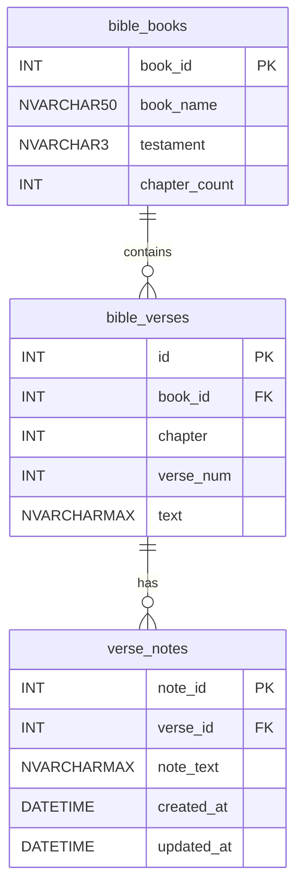

# 👁️‍🗨️ CST-391: JavaScript Web Application Development

- Milestone Project: Bible Verse Searcher
- Author: **Victor Manuel Marrujo Verdugo**
- College of Humanities and Social Sciences, Grand Canyon University
- Professor Bobby Estey
- May 31st, 2026

---

## Screencast Links

| Part | Description | Link |
|------|-------------|------|
| Presentation Part 1 | PowerPoint walkthrough - Project Overview, REST API, Angular | [Watch on Loom](https://www.loom.com/share/4a830b5f9a704e799a3d5562a2357832) |
| Presentation Part 2 | PowerPoint walkthrough - React, Accessibility, Lessons Learned | [Watch on Loom](https://www.loom.com/share/9043b4e2881040ca9015532c03feade7) |
| Live Demo | Postman, Angular, and React end-to-end demonstration | [Watch on Loom](https://www.loom.com/share/fc204acce0864ecf9860d3b04d0e9c4b) |

---

# Section 01 - Project Overview

## What Was Built

The **Bible Verse Searcher** is a full-stack web application built across three milestones:

- **Milestone 3** - REST API using Node.js, Express, TypeScript, and MySQL
- **Milestone 4** - Angular 17 front-end SPA consuming that API
- **Milestone 5** - React 18 front-end SPA consuming the same API

The application allows users to search scripture by keyword, browse by book and chapter, view individual verses, and attach personal notes to any verse. It aligns with a Christian worldview by providing a digital tool for Bible study and personal reflection.

## N-Layer Architecture

```
React / Angular (SPA - presentation layer)
        ↓  HTTP requests
Express REST API (business logic / façade layer)
        ↓  SQL queries
MySQL 8 (data layer)
```

All three layers run independently. Both front-end applications consume the same API, meaning a change to the back-end automatically applies to both UIs.

---

# Section 02 - Milestone 3: REST API

## Technology Stack

| Layer | Technology |
|-------|-----------|
| Runtime | Node.js 20 |
| Framework | Express 4 |
| Language | TypeScript 5 |
| Database driver | mysql2/promise (connection pool) |
| Database | MySQL 8 |
| Testing | Postman |

## Database Schema

Three tables with enforced foreign key constraints:



- `bible_books` → `bible_verses`: one book contains many verses (FK `book_id`)
- `bible_verses` → `verse_notes`: one verse has many notes (FK `verse_id`)
- Both foreign keys use `ON DELETE CASCADE`, deleting a verse automatically removes its notes

## REST API Endpoints (14 total)

### Books

| Method | Endpoint | Description |
|--------|----------|-------------|
| GET | /api/books | List all 66 books |
| GET | /api/books/:id | Get single book |
| GET | /api/books/:id/chapters | Chapter count for a book |

### Verses

| Method | Endpoint | Description |
|--------|----------|-------------|
| GET | /api/verses?q=keyword&testament=OT\|NT | Keyword search + filter |
| GET | /api/verses?book=:id&chapter=:n | Reference browse |
| GET | /api/verses/:id | Single verse |
| POST | /api/verses | Create verse |
| PUT | /api/verses/:id | Update verse |
| DELETE | /api/verses/:id | Delete verse |

### Notes (nested under Verses)

| Method | Endpoint | Description |
|--------|----------|-------------|
| GET | /api/verses/:id/notes | All notes for a verse |
| GET | /api/verses/:id/notes/:nid | Single note |
| POST | /api/verses/:id/notes | Create note |
| PUT | /api/verses/:id/notes/:nid | Update note |
| DELETE | /api/verses/:id/notes/:nid | Delete note |

### REST Conventions Applied

- **Plural nouns** as resources - `/verses`, `/books`, `/notes`
- **Hierarchical paths** - `/api/verses/:id/notes` nests notes under their parent verse
- **HTTP verbs carry intent** - GET retrieves, POST creates, PUT updates, DELETE removes
- **Consistent status codes** - 200, 201, 204, 400, 404, 500

---

# Section 03 - Milestone 4: Angular Front-End

## Technology Stack

| Concern | Choice |
|---------|--------|
| Framework | Angular 17 (Standalone Components) |
| Language | TypeScript 5 |
| Routing | @angular/router with lazy loadComponent |
| HTTP | Angular HttpClient (provideHttpClient) |
| Styles | Bootstrap 5.3 via CDN |
| Dev port | localhost:4200 |

## Full CRUD Component Map

| CRUD | Route | Component | API Call |
|------|-------|-----------|----------|
| Read (all) | /verses | VerseListComponent | GET /api/verses?q=&testament= |
| Create | /verses/new | VerseFormComponent | POST /api/verses |
| Read (one) | /verses/:id | VerseDetailComponent | GET /api/verses/:id |
| Update | /verses/:id/edit | VerseFormComponent | PUT /api/verses/:id |
| Delete | (button) | VerseList / VerseDetail | DELETE /api/verses/:id |

## Route Definitions

```
/                    → redirect to /verses
/verses              → VerseListComponent   (Read all + search + delete)
/verses/new          → VerseFormComponent   (Create)
/verses/:id          → VerseDetailComponent (Read one + Notes CRUD)
/verses/:id/edit     → VerseFormComponent   (Update - pre-populated)
```

## Key Architectural Decisions

- **Standalone components** - Angular 17 pattern; each component declares its own `imports[]`, no NgModule required
- **Lazy-loaded routes** - `loadComponent: () => import(...).then(m => m.ComponentClass)` reduces initial bundle size
- **One VerseService** - all HTTP calls centralized; components stay thin and focused on presentation
- **Shared VerseFormComponent** - handles both Create and Edit; the route `:id` param determines the mode
- **Bootstrap 5 via CDN** - no Angular wrapper library needed for a course project

---

# Section 04 - Milestone 5: React Front-End

## Technology Stack

| Concern | Choice |
|---------|--------|
| Library | React 18 |
| Language | TypeScript 5 |
| Routing | React Router v6 (BrowserRouter + Routes) |
| HTTP | Axios |
| State | useState + useEffect hooks |
| Build tool | Vite 5 |
| Styles | Bootstrap 5.3 via CDN |
| Dev port | localhost:5173 |

## Full CRUD Component Map

| CRUD | Route | Component | API Call |
|------|-------|-----------|----------|
| Read (all) | /verses | VerseList | GET /api/verses?q=&testament= |
| Create | /verses/new | VerseForm | POST /api/verses |
| Read (one) | /verses/:id | VerseDetail | GET /api/verses/:id |
| Update | /verses/:id/edit | VerseForm | PUT /api/verses/:id |
| Delete | (button) | VerseList / VerseDetail | DELETE /api/verses/:id |

## Angular vs React - Direct Comparison

| Concern | Angular (M4) | React (M5) |
|---------|-------------|------------|
| Framework type | Full framework (opinionated) | UI library (flexible) |
| Routing | @angular/router + loadComponent | React Router v6 + BrowserRouter |
| HTTP | Angular HttpClient | Axios (.then(r => r.data)) |
| State | Class properties + ngOnInit | useState + useEffect hooks |
| Templates | HTML + \*ngFor / \*ngIf | JSX (JavaScript in markup) |
| Shared form | Route :id param in component | useParams() hook |
| Build tool | Angular CLI / webpack | Vite (faster HMR) |
| Dev port | localhost:4200 | localhost:5173 |

Both implementations are visually identical and consume the same API. The choice of framework matters far less than clean architecture since the typed service layer made the React port of the Angular app straightforward.

---

# Section 05 - Accessibility & Christian Worldview

## The Christian Imperative

> *"Love your neighbor as yourself."* - Matthew 22:39

As Christian developers, we are called to serve **all people**, including those with disabilities. Web accessibility is not merely a legal checkbox or a performance metric; it is a direct expression of the command to love our neighbor.

When we build digital tools, we are stewards of technology. In this project specifically, we are building a tool centered on scripture. The responsibility to make that scripture accessible to **everyone**, regardless of ability, is central to the mission of the application.

> **1 in 4 U.S. adults live with a disability.** Inaccessible websites exclude them entirely from accessing content, services, and community.

## WCAG - The Four Principles

The Web Content Accessibility Guidelines (WCAG) organize accessibility requirements under four principles:

### 1. Perceivable
Users must be able to perceive all information presented.

- Add `alt` text to all images (e.g., verse screenshots, ER diagrams)
- Maintain sufficient color contrast, such as the minimum ratio of 4.5:1 for normal text
- Provide captions or transcripts for screencasts and video content

### 2. Operable
Users must be able to operate all interface components.

- Full keyboard navigation, where every action reachable by Tab, Enter, and Escape
- Add a skip-to-content link at the top of every page
- No keyboard traps in modals, dropdowns, or dialogs

### 3. Understandable
Users must be able to understand the interface and its content.

- Use visible `<label>` elements and never rely on placeholder text alone
- Provide clear, descriptive error messages per field (not just "invalid input")
- Maintain consistent navigation structure across every page

### 4. Robust
Content must be robust enough for assistive technologies to interpret reliably.

- Use semantic HTML like `<nav>`, `<main>`, `<button>`, `<form>` instead of generic `<div>` elements
- Add ARIA roles and labels where native HTML semantics are insufficient
- Test with screen readers (NVDA on Windows, VoiceOver on macOS)

## Applied to This Project

### Already Implemented

- **Bootstrap 5 components** - keyboard-accessible by default (buttons, forms, dropdowns)
- **Semantic HTML** - `<nav>`, `<main>`, `<button>`, `<form>` used throughout
- **Color contrast** - Bootstrap's primary blue (`#0d6efd`) passes WCAG AA at normal text sizes
- **Visible form labels** - every input field has an associated `<label>` element
- **Confirm dialogs** before all destructive actions (delete verse, delete note)

### Planned Improvements

- Add `aria-label` to icon-only buttons (Edit ✏️, Delete 🗑) so screen readers announce intent
- Add `role="alert"` to error message containers so they are announced immediately
- Add a skip-to-content link at the top of both the Angular and React NavBar
- Conduct a full keyboard Tab-order audit of both front-end implementations
- Run a Lighthouse accessibility audit targeting a score of 90 or above

### UX Impact

Making scripture accessible to all users regardless of visual, motor, or cognitive ability is not just a technical improvement. It directly advances the purpose of this application. A blind user who relies on a screen reader deserves the same access to Bible verses and personal notes as any other user.

---

# Section 06 - Challenges & Lessons Learned

## Top Challenges Across All Milestones

### M3 - Express nested router `mergeParams`
Express does not forward route parameters to mounted sub-routers by default. The notes router is mounted under `/api/verses/:id/notes`, but without `mergeParams: true`, the `:id` param is invisible inside the notes router. This is now a standing template item for every nested REST API.

### M4 - Angular 17 standalone components
Angular 17 removes NgModule from the default workflow. Every component declares its own `imports[]` array, and the app-level config moved to `app.config.ts` using `provideRouter()` and `provideHttpClient()`. The documentation for this pattern is scattered, which made initial setup time-consuming.

### M5 - Stale state after delete
Using `setVerses(verses.filter(...))` captured a stale closure - the `verses` value at the time the delete button was clicked, not the latest state. The fix - `setVerses(prev => prev.filter(...))` - always reads the current state snapshot and is now a default pattern for all state updates that depend on previous state.

### M3–M5 - CORS across multiple ports
The API runs on `:3000`, Angular on `:4200`, and React on `:5173`. Browsers block cross-origin requests by default. The `cors()` middleware in Express was the single most important configuration item to validate before writing any front-end code. Always test API → browser connectivity before writing UI components.

## Lessons Learned

1. **Type API contracts before writing any code** - TypeScript interfaces for request/response shapes caught potential runtime errors at compile time across all three milestones. Type-first design pays dividends immediately.

2. **Test one endpoint at a time in Postman** - wiring multiple routes before testing any led to compounded errors. Test → confirm → commit is consistently faster, especially with nested resources.

3. **Database FK constraints simplify the API** - `ON DELETE CASCADE` on `verse_notes` eliminated all application-level cleanup logic. Good schema design reduces service layer complexity significantly.

4. **Both frameworks produce the same result** - Angular and React produce visually identical applications consuming the same API. The choice of framework matters far less than clean architecture. The typed service layer made the React port straightforward.

5. **Vite is noticeably faster than webpack** - HMR in Vite is near-instant. For course project iteration speed, the developer experience difference is significant enough to prefer Vite for any future React work.

6. **Accessibility is not optional** - building a tool centered on scripture highlights the responsibility to serve all users. WCAG compliance is both a technical best practice and a direct expression of loving your neighbor.

---

> *"Whatever you do, work at it with all your heart, as working for the Lord, not for human masters."*
> - Colossians 3:23